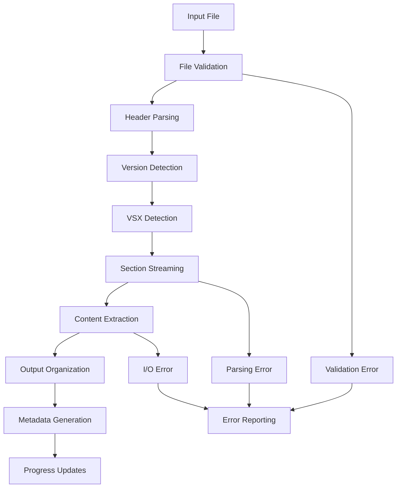
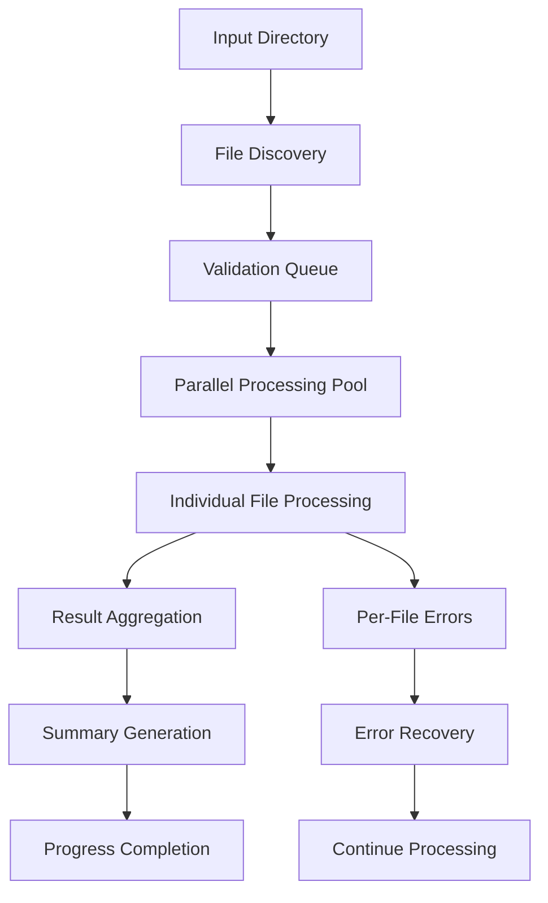
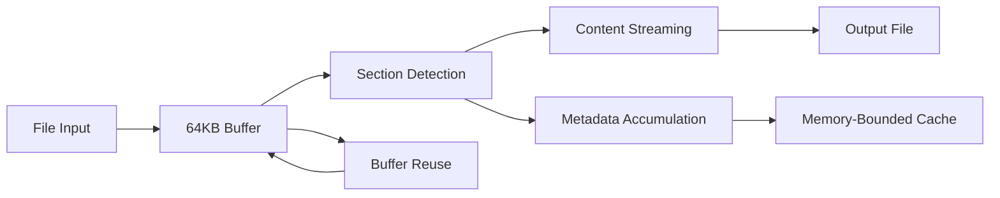
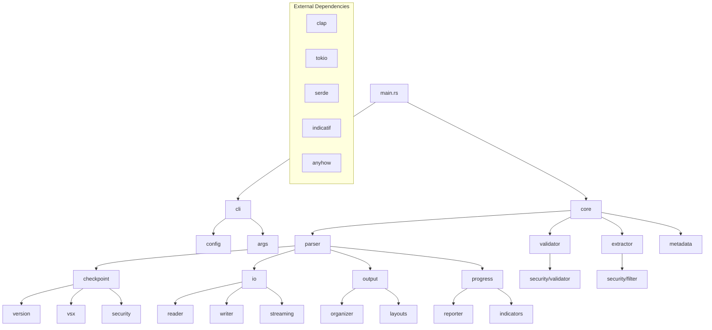

# Check Point Diagnostic Section Parser - System Architecture Document

## Executive Summary

This document defines the technical architecture for a high-performance, enterprise-grade Check Point diagnostic section parser built in Rust. The architecture prioritizes streaming I/O processing, robust CLI design, comprehensive error handling, and enterprise security while meeting the specific requirements of Check Point network administrators and TAC workflows.

**Key Architectural Objectives:**
- **Enterprise Performance**: Process 50MB+ diagnostic files with <500MB memory usage
- **Streaming Architecture**: Constant memory usage through buffered I/O regardless of file size
- **Fault Tolerance**: Graceful error recovery with detailed progress reporting
- **Security-First**: Read-only operations with comprehensive path validation
- **TAC Integration**: Output format compatibility with Check Point support workflows

## System Architecture Overview

### High-Level Architecture Pattern
- **Pattern**: Modular CLI Tool with State Machine-Based Parsing Engine
- **Deployment**: Single Binary Distribution with Enterprise Packaging Options
- **Communication**: Event-driven Progress Reporting with Structured Logging
- **Processing Model**: Streaming I/O with Memory-Bounded State Management
- **Performance Strategy**: Async/await for parallel processing with tokio runtime

### Core Design Principles

1. **Memory Efficiency**: Streaming processing with bounded memory usage (target <500MB for 100MB+ files)
2. **Precision**: Exact delimiter pattern validation with zero false positives/negatives
3. **Performance**: Sub-linear memory growth with configurable resource limits
4. **Enterprise Security**: Path validation, audit trails, and read-only operation modes
5. **Fault Tolerance**: Continue processing after individual section errors with detailed recovery
6. **Domain Expertise**: Check Point-specific optimizations for VSX, TAC workflows, and version compatibility
7. **Developer Experience**: Clear error messages with actionable remediation suggestions

## Component Breakdown

### User Interface Layer

#### CLI Framework
- **Primary Framework**: `clap` v4.x with derive macros for type-safe argument parsing
- **Command Structure**: Single binary with hierarchical subcommands following Check Point workflows
- **Configuration Management**: Hierarchical config (global → user → project) with environment variable support
- **Help System**: Context-sensitive help with Check Point-specific examples and terminology
- **Shell Integration**: Auto-completion support for bash/zsh with command history

```rust
// Enhanced CLI Structure Design with Check Point Domain Integration
#[derive(Parser)]
#[command(name = "cpparser")]
#[command(about = "Check Point diagnostic section parser for enterprise environments")]
#[command(version, author)]
#[command(long_about = "High-performance parser for Check Point cpinfo diagnostic files with enterprise features")]
struct Cli {
    #[command(subcommand)]
    command: Commands,
    
    /// Enable verbose output with detailed progress
    #[arg(short, long, global = true)]
    verbose: bool,
    
    /// Configuration file path
    #[arg(short, long, global = true, value_name = "FILE")]
    config: Option<PathBuf>,
    
    /// Enable enterprise mode for large files (>50MB)
    #[arg(long, global = true)]
    enterprise_mode: bool,
}

#[derive(Subcommand)]
enum Commands {
    /// Extract sections from diagnostic files
    Extract {
        /// Input section file or directory
        input: PathBuf,
        
        /// Output directory
        #[arg(short, long)]
        output: Option<PathBuf>,
        
        #[command(flatten)]
        options: ExtractOptions,
    },
    
    /// Validate diagnostic file format
    Validate {
        /// Input file to validate
        input: PathBuf,
        
        /// Show detailed validation report
        #[arg(long)]
        detailed: bool,
    },
    
    /// Process multiple diagnostic files
    Batch {
        /// Input directory containing diagnostic files
        input_dir: PathBuf,
        
        /// Output base directory
        #[arg(short, long)]
        output_dir: Option<PathBuf>,
        
        /// Number of parallel processing threads
        #[arg(short, long, default_value = "4")]
        threads: usize,
    },
    
    /// Interactive mode with guided options
    Interactive,
}

#[derive(Args)]
struct ExtractOptions {
    /// Show real-time progress indicators
    #[arg(long, default_value = "true")]
    progress: bool,
    
    /// Filter sections (fw,vpn,mgmt,system)
    #[arg(long, value_delimiter = ',')]
    section_filter: Option<Vec<String>>,
    
    /// Preserve binary content integrity
    #[arg(long)]
    preserve_binary: bool,
    
    /// Format output for Check Point TAC submission
    #[arg(long)]
    tac_format: bool,
    
    /// Memory limit in MB
    #[arg(long, default_value = "500")]
    memory_limit: usize,
    
    /// Continue processing after errors
    #[arg(long)]
    continue_on_error: bool,
}
```

#### Progress Reporting System
- **Framework**: `indicatif` v0.17+ with tokio integration for async-aware progress
- **Multi-Level Reporting**: File-level and batch-level progress with memory usage monitoring
- **Real-time Updates**: Sub-second progress updates with ETA calculations
- **Accessibility**: Screen reader compatible output with structured text formatting
- **Enterprise Features**: Progress checkpointing for large operations and resume capability

```rust
use indicatif::{MultiProgress, ProgressBar, ProgressStyle, ProgressState, ProgressFinish};

pub struct EnterpriseProgressReporter {
    multi_progress: MultiProgress,
    main_bar: ProgressBar,
    detail_bar: ProgressBar,
    memory_monitor: MemoryMonitor,
    eta_calculator: ETACalculator,
}

impl EnterpriseProgressReporter {
    pub fn new(total_files: u64, current_file_size: u64) -> Self {
        let multi_progress = MultiProgress::new();
        
        // Main progress bar for batch operations
        let main_bar = multi_progress.add(ProgressBar::new(total_files));
        main_bar.set_style(ProgressStyle::with_template(
            "[{elapsed_precise}] {bar:40.cyan/blue} {pos:>7}/{len:7} files {msg}"
        ).unwrap().progress_chars("=>-"));
        
        // Detail progress bar for current file
        let detail_bar = multi_progress.add(ProgressBar::new(current_file_size));
        detail_bar.set_style(ProgressStyle::with_template(
            "  └─ {bar:40.green/yellow} {bytes:>10}/{total_bytes:10} {bytes_per_sec:>12} ETA: {eta:>5}"
        ).unwrap().progress_chars("█▉▊▋▌▍▎▏  "));
        
        Self {
            multi_progress,
            main_bar,
            detail_bar,
            memory_monitor: MemoryMonitor::new(),
            eta_calculator: ETACalculator::new(),
        }
    }
    
    pub fn update_file_progress(&self, bytes_processed: u64, filename: &str) {
        self.detail_bar.set_position(bytes_processed);
        
        // Add memory usage warning if approaching limits
        let memory_mb = self.memory_monitor.current_usage_mb();
        if memory_mb > 400 {
            self.detail_bar.set_message(format!("{} [Memory: {}MB]", filename, memory_mb));
        } else {
            self.detail_bar.set_message(filename.to_string());
        }
    }
    
    pub fn complete_file(&self, filename: &str, extraction_stats: &ExtractionStats) {
        self.main_bar.inc(1);
        self.main_bar.set_message(format!(
            "Completed: {} ({} commands, {} files)", 
            filename, 
            extraction_stats.commands_extracted,
            extraction_stats.files_extracted
        ));
        
        // Reset detail bar for next file
        self.detail_bar.set_position(0);
    }
}
```

### Business Logic Layer

#### Core Parser Engine
```rust
// State Machine-Based Parser Architecture
#[derive(Debug, Clone, PartialEq)]
pub enum ParserState {
    ScanningForDelimiter,
    ValidatingPattern { 
        pattern_type: DelimiterType, 
        line_count: usize,
        opening_line: String 
    },
    ExtractingContent { 
        content_type: ContentType, 
        content_name: String,
        start_line: usize 
    },
    ProcessingComplete,
    ErrorRecovery { error: ParseError },
}

#[derive(Debug, Clone, PartialEq)]
pub enum DelimiterType {
    Command23Dash,  // Exactly 23 dashes
    Command24Dash,  // Exactly 24 dashes  
    File66Dash,     // Exactly 66 dashes
}

#[derive(Debug, Clone, PartialEq)]
pub enum ContentType {
    Command,
    File,
}

pub struct StateMachineParser {
    state: ParserState,
    delimiter_validator: DelimiterValidator,
    content_extractor: ContentExtractor,
    progress_reporter: Box<dyn ProgressReporter>,
    error_recovery: ErrorRecoveryManager,
}

impl StateMachineParser {
    pub fn handle_line(&mut self, line: &str, line_number: usize) -> Result<Vec<Action>> {
        match (&self.state, line) {
            (ParserState::ScanningForDelimiter, line) => {
                if let Some(delimiter_type) = self.delimiter_validator.detect_delimiter(line) {
                    self.state = ParserState::ValidatingPattern {
                        pattern_type: delimiter_type,
                        line_count: 1,
                        opening_line: line.to_string(),
                    };
                    Ok(vec![Action::ContinueReading])
                } else {
                    Ok(vec![Action::ContinueReading])
                }
            }
            
            (ParserState::ValidatingPattern { pattern_type, line_count, opening_line }, line) => {
                match line_count {
                    1 => {
                        // This should be the command/file name line
                        self.state = ParserState::ExtractingContent {
                            content_type: pattern_type.to_content_type(),
                            content_name: line.trim().to_string(),
                            start_line: line_number + 1,
                        };
                        Ok(vec![Action::StartExtraction(line.trim().to_string())])
                    }
                    2 => {
                        // This should be the closing delimiter - validate it matches opening
                        if line == opening_line {
                            // Valid delimiter pattern completed, now expecting content
                            Ok(vec![Action::ContinueReading])
                        } else {
                            let error = ParseError::MismatchedDelimiter {
                                line: line_number,
                                expected: opening_line.clone(),
                                found: line.to_string(),
                            };
                            self.state = ParserState::ErrorRecovery { error: error.clone() };
                            Ok(vec![Action::ReportError(error)])
                        }
                    }
                    _ => {
                        let error = ParseError::InvalidDelimiterStructure {
                            line: line_number,
                            expected_lines: 3,
                            found_lines: *line_count + 1,
                        };
                        self.state = ParserState::ErrorRecovery { error: error.clone() };
                        Ok(vec![Action::ReportError(error)])
                    }
                }
            }
            
            (ParserState::ExtractingContent { content_type, content_name, .. }, line) => {
                // Check if this line starts a new section
                if let Some(new_delimiter_type) = self.delimiter_validator.detect_delimiter(line) {
                    // Complete current extraction and start new section
                    let complete_action = Action::CompleteExtraction;
                    self.state = ParserState::ValidatingPattern {
                        pattern_type: new_delimiter_type,
                        line_count: 1,
                        opening_line: line.to_string(),
                    };
                    Ok(vec![complete_action, Action::ContinueReading])
                } else {
                    // Continue extracting content
                    Ok(vec![Action::ExtractContent(line.to_string())])
                }
            }
            
            (ParserState::ErrorRecovery { .. }, line) => {
                // Try to recover by looking for next valid delimiter
                if let Some(delimiter_type) = self.delimiter_validator.detect_delimiter(line) {
                    self.state = ParserState::ValidatingPattern {
                        pattern_type: delimiter_type,
                        line_count: 1,
                        opening_line: line.to_string(),
                    };
                    Ok(vec![Action::RecoverySuccess, Action::ContinueReading])
                } else {
                    Ok(vec![Action::ContinueRecovery])
                }
            }
            
            (ParserState::ProcessingComplete, _) => {
                Ok(vec![Action::Ignore])
            }
        }
    }
}

#[derive(Debug, Clone)]
pub enum Action {
    ContinueReading,
    StartExtraction(String),
    ExtractContent(String),
    CompleteExtraction,
    ReportError(ParseError),
    RecoverySuccess,
    ContinueRecovery,
    Ignore,
}

// Main parsing coordinator with async support
pub struct SectionParser {
    config: ParserConfig,
    validator: FileValidator,
    extractor: ContentExtractor,
    organizer: OutputOrganizer,
    progress: Arc<dyn ProgressReporter>,
    state_machine: StateMachineParser,
}

impl SectionParser {
    pub async fn process_file(&mut self, input_path: &Path) -> Result<ProcessingResults> {
        let file = File::open(input_path).await?;
        let mut reader = BufReader::new(file);
        let mut line_buffer = String::new();
        let mut line_number = 0;
        let mut processing_stats = ProcessingStats::new();
        
        while reader.read_line(&mut line_buffer).await? > 0 {
            line_number += 1;
            
            let actions = self.state_machine.handle_line(&line_buffer, line_number)?;
            
            for action in actions {
                match action {
                    Action::StartExtraction(name) => {
                        self.extractor.start_extraction(&name, line_number)?;
                    }
                    Action::ExtractContent(content) => {
                        self.extractor.add_content(&content)?;
                    }
                    Action::CompleteExtraction => {
                        let result = self.extractor.complete_extraction().await?;
                        processing_stats.record_extraction(result);
                        self.progress.report_section_complete();
                    }
                    Action::ReportError(error) => {
                        processing_stats.record_error(error.clone());
                        self.progress.report_error(&error);
                    }
                    _ => {}
                }
            }
            
            line_buffer.clear();
            self.progress.update_file_progress(reader.stream_position().await?, &input_path.to_string_lossy());
        }
        
        Ok(ProcessingResults {
            stats: processing_stats,
            output_files: self.extractor.get_output_files(),
        })
    }
}
```

#### Section Processing Pipeline
1. **File Validation**: Format verification and version detection
2. **Header Parsing**: CPinfo metadata extraction
3. **Section Detection**: Delimiter-based section identification
4. **Content Extraction**: Streaming content capture
5. **Output Organization**: VSX-aware file structure creation

#### Check Point Domain Services

##### Version Detection Service
```rust
pub struct VersionDetector {
    patterns: HashMap<&'static str, CheckPointVersion>,
}

#[derive(Debug, Clone)]
pub struct CheckPointVersion {
    pub os_version: String,        // R81.10, R81.20, R82
    pub build_number: String,      // 914000250
    pub deployment_type: DeploymentType,
    pub cpinfo_version: String,
}

#[derive(Debug, Clone)]
pub enum DeploymentType {
    Gateway,
    VSXCluster { member_count: u8 },
    ManagementServer,
    StandaloneVSX,
}
```

##### VSX Context Manager
```rust
pub struct VsxContextManager {
    vs_contexts: HashMap<u8, VirtualSystemContext>,
    cluster_info: Option<ClusterInfo>,
}

#[derive(Debug, Clone)]
pub struct VirtualSystemContext {
    pub vs_id: u8,
    pub name: Option<String>,
    pub context_type: VsContextType,
    pub sections: Vec<SectionReference>,
}

#[derive(Debug, Clone)]
pub enum VsContextType {
    Management,     // VS 0
    Customer(u8),   // VS 1+
}
```

##### Security Blade Analyzer
```rust
pub struct SecurityBladeAnalyzer {
    blade_patterns: HashMap<&'static str, BladeInfo>,
}

#[derive(Debug, Clone)]
pub struct BladeInfo {
    pub name: String,
    pub category: SecurityCategory,
    pub version_pattern: Option<regex::Regex>,
    pub config_sections: Vec<&'static str>,
}

#[derive(Debug, Clone)]
pub enum SecurityCategory {
    Firewall,
    VPN,
    IPS,
    AntiBot,
    AntiVirus,
    Application,
    URL,
    DataLoss,
    Threat,
}
```

### Data Layer

#### File I/O Architecture

##### Streaming Reader Implementation
```rust
pub struct BufferedCpinfoReader<R: Read> {
    inner: BufReader<R>,
    buffer: CircularBuffer,
    position: u64,
    file_size: Option<u64>,
}

impl<R: Read> BufferedCpinfoReader<R> {
    const BUFFER_SIZE: usize = 64 * 1024; // 64KB default buffer
    
    pub fn new(reader: R) -> Self { /* ... */ }
    
    pub fn read_until_delimiter(&mut self) -> Result<Section> { /* ... */ }
    
    pub fn peek_section_header(&mut self) -> Result<Option<SectionHeader>> { /* ... */ }
}
```

##### Section Extraction Pipeline
```rust
pub struct SectionExtractor {
    delimiter_pattern: &'static [u8], // 46 equal signs
    sanitizer: FileNameSanitizer,
    vsx_detector: VsxSectionDetector,
}

impl SectionExtractor {
    pub async fn extract_section<W: AsyncWrite>(
        &self,
        reader: &mut BufferedCpinfoReader<impl Read>,
        writer: &mut W,
        header: &SectionHeader,
    ) -> Result<SectionMetadata> { /* ... */ }
}
```

#### Output Organization System

##### Directory Structure Manager
```rust
pub struct OutputOrganizer {
    base_path: PathBuf,
    structure_type: OutputStructure,
    sanitizer: PathSanitizer,
}

#[derive(Debug, Clone)]
pub enum OutputStructure {
    Standard(StandardLayout),
    VsxAware(VsxLayout),
    Compliance(ComplianceLayout),
    Custom(CustomLayout),
}

pub struct StandardLayout {
    pub system_dir: &'static str,
    pub security_dir: &'static str,
    pub network_dir: &'static str,
    pub logs_dir: &'static str,
    pub advanced_dir: &'static str,
}
```

##### Metadata Generation System
```rust
pub struct MetadataGenerator {
    version_detector: VersionDetector,
    blade_analyzer: SecurityBladeAnalyzer,
    vsx_manager: VsxContextManager,
}

#[derive(Serialize, Deserialize)]
pub struct CpinfoMetadata {
    pub file_info: FileInfo,
    pub checkpoint_info: CheckPointInfo,
    pub sections: SectionSummary,
    pub security_summary: Option<SecuritySummary>,
    pub vsx_summary: Option<VsxSummary>,
    pub processing_notes: Vec<String>,
}
```

## Technology Stack Selection

### Core Technologies

#### Rust Ecosystem Crates
```toml
[dependencies]
# CLI Framework - Comprehensive argument parsing with type safety
clap = { version = "4.5", features = ["derive", "env", "color", "suggestions"] }

# Async Runtime - Multi-threaded async support for parallel processing
tokio = { version = "1.40", features = ["rt-multi-thread", "fs", "io-util", "macros", "signal"] }
futures = "0.3"

# File I/O and Streaming - Memory-efficient large file processing
tokio-util = { version = "0.7", features = ["io", "codec"] }

# Progress and User Interface - Enterprise-grade progress reporting
indicatif = { version = "0.17", features = ["rayon", "tokio"] }
console = "0.15"

# Error Handling - Hierarchical error management
anyhow = { version = "1.0", features = ["backtrace"] }
thiserror = "1.0"

# Serialization and Configuration - Structured data handling
serde = { version = "1.0", features = ["derive"] }
serde_json = "1.0"
toml = "0.8"
config = { version = "0.14", features = ["toml", "yaml"] }

# Text Processing and Validation
regex = "1.10"
unicode-normalization = "0.1"

# Security and Path Handling - Cross-platform path sanitization
sanitize-filename = "0.5"
path-absolutize = "3.1"

# Memory Management and Performance
bytes = "1.5"
memmap2 = "0.9"  # For very large file support
rayon = "1.8"    # Data parallelism

# Logging and Monitoring - Structured logging with enterprise features
tracing = "0.1"
tracing-subscriber = { version = "0.3", features = ["env-filter", "json", "fmt"] }
tracing-appender = "0.2"

# Configuration Management
directories = "5.0"  # Cross-platform config directories

# Check Point Domain-Specific
chrono = { version = "0.4", features = ["serde"] }  # Timestamp handling
uuid = { version = "1.6", features = ["v4"] }       # Unique identifiers

# Testing Framework and Development Tools
[dev-dependencies]
tempfile = "3.8"
assert_fs = "1.1"
predicates = "3.0"
criterion = { version = "0.5", features = ["html_reports"] }  # Benchmarking
proptest = "1.4"     # Property-based testing
tokio-test = "0.4"   # Async testing utilities

# Optional features for enterprise deployment
[features]
default = ["progress", "parallel", "enterprise"]
progress = ["indicatif"]
parallel = ["tokio/rt-multi-thread", "rayon"]
enterprise = ["tracing-appender", "memmap2"]
minimal = []  # Minimal build for resource-constrained environments
```

### Architecture Decision Records (ADRs)

#### ADR-001: Streaming vs Memory-Loading Architecture
- **Decision**: Implement streaming parser with fixed buffer sizes
- **Rationale**: CPinfo files can be multi-GB; memory loading would cause failures
- **Alternatives**: Memory mapping (rejected due to file size constraints)
- **Implementation**: `BufReader` with 64KB buffers and circular buffer management

#### ADR-002: Synchronous vs Asynchronous I/O
- **Decision**: Hybrid approach - sync for single file, async for batch processing
- **Rationale**: Single file parsing is inherently sequential; batch benefits from parallelism
- **Alternatives**: Full async (complexity overhead), full sync (poor batch performance)
- **Implementation**: `tokio` runtime for batch mode, standard sync I/O for single files

#### ADR-003: CLI Framework Selection
- **Decision**: `clap` v4 with derive macros
- **Rationale**: Excellent documentation generation, type safety, mature ecosystem
- **Alternatives**: `structopt` (deprecated), manual parsing (maintenance burden)
- **Implementation**: Hierarchical command structure with option groups

#### ADR-004: Error Handling Strategy
- **Decision**: `thiserror` for domain-specific errors + `anyhow` for application-level error aggregation
- **Rationale**: `thiserror` enables precise error recovery in parsing engine; `anyhow` simplifies CLI error reporting
- **Alternatives**: Standard library only (poor context), `anyhow` only (limited recovery options)
- **Implementation**: Hierarchical error types with contextual wrapping and actionable error messages

```rust
// Domain-specific errors with thiserror for precise error handling
#[derive(Debug, thiserror::Error)]
pub enum ParseError {
    #[error("Invalid delimiter pattern at line {line}: expected {expected} dashes, found {found}")]
    InvalidDelimiter { line: usize, expected: usize, found: usize },
    
    #[error("Mismatched delimiter at line {line}: expected '{expected}', found '{found}'")]
    MismatchedDelimiter { line: usize, expected: String, found: String },
    
    #[error("Invalid delimiter structure at line {line}: expected {expected_lines} lines, found {found_lines}")]
    InvalidDelimiterStructure { line: usize, expected_lines: usize, found_lines: usize },
    
    #[error("I/O error during processing: {0}")]
    Io(#[from] std::io::Error),
    
    #[error("Memory limit exceeded: {current_mb}MB > {limit_mb}MB")]
    MemoryLimitExceeded { current_mb: usize, limit_mb: usize },
    
    #[error("Output path validation failed: {path}")]
    InvalidOutputPath { path: String },
    
    #[error("Content extraction failed for {content_type} '{name}': {details}")]
    ExtractionFailed { content_type: String, name: String, details: String },
}

#[derive(Debug, thiserror::Error)]
pub enum ConfigurationError {
    #[error("Invalid configuration value for {key}: {details}")]
    InvalidValue { key: String, details: String },
    
    #[error("Missing required configuration: {key}")]
    MissingRequired { key: String },
    
    #[error("Configuration file error: {0}")]
    FileError(#[from] std::io::Error),
}

#[derive(Debug, thiserror::Error)]
pub enum ValidationError {
    #[error("File format not supported: {format}")]
    UnsupportedFormat { format: String },
    
    #[error("File size exceeds limit: {size_mb}MB > {limit_mb}MB")]
    FileTooLarge { size_mb: u64, limit_mb: u64 },
    
    #[error("Path security validation failed: {path} - {reason}")]
    SecurityViolation { path: String, reason: String },
}

// Application-level error aggregation with anyhow for CLI simplicity
pub type Result<T> = anyhow::Result<T>;

// Error context enhancement for CLI users
pub trait ErrorContextExt<T> {
    fn with_context_line(self, line: usize) -> Result<T>;
    fn with_file_context(self, file_path: &Path) -> Result<T>;
    fn with_recovery_suggestion(self, suggestion: &str) -> Result<T>;
}

impl<T, E> ErrorContextExt<T> for std::result::Result<T, E>
where
    E: Into<anyhow::Error>,
{
    fn with_context_line(self, line: usize) -> Result<T> {
        self.with_context(|| format!("at line {}", line))
    }
    
    fn with_file_context(self, file_path: &Path) -> Result<T> {
        self.with_context(|| format!("while processing file: {}", file_path.display()))
    }
    
    fn with_recovery_suggestion(self, suggestion: &str) -> Result<T> {
        self.with_context(|| format!("Recovery suggestion: {}", suggestion))
    }
}

// Error recovery manager for graceful degradation
pub struct ErrorRecoveryManager {
    continue_on_error: bool,
    max_consecutive_errors: usize,
    consecutive_error_count: usize,
    recovery_strategies: HashMap<String, RecoveryStrategy>,
}

#[derive(Debug, Clone)]
pub enum RecoveryStrategy {
    SkipSection,
    RetryWithBackoff { max_attempts: usize },
    FallbackToPartialExtraction,
    AbortProcessing,
}

impl ErrorRecoveryManager {
    pub fn handle_parse_error(&mut self, error: &ParseError, context: &ParsingContext) -> RecoveryAction {
        match error {
            ParseError::InvalidDelimiter { .. } | ParseError::MismatchedDelimiter { .. } => {
                if self.continue_on_error {
                    RecoveryAction::SkipToNextDelimiter
                } else {
                    RecoveryAction::Abort
                }
            }
            ParseError::MemoryLimitExceeded { .. } => {
                RecoveryAction::FlushBuffersAndContinue
            }
            ParseError::ExtractionFailed { .. } => {
                RecoveryAction::CreateEmptyOutput
            }
            _ => RecoveryAction::Abort,
        }
    }
}

#[derive(Debug, Clone)]
pub enum RecoveryAction {
    SkipToNextDelimiter,
    FlushBuffersAndContinue,
    CreateEmptyOutput,
    Abort,
}
```

#### ADR-005: Output Organization Strategy
- **Decision**: Pluggable organizer pattern with built-in layouts
- **Rationale**: Different users need different organization schemes (VSX, compliance, etc.)
- **Alternatives**: Single fixed layout (inflexible), configuration-only (complexity)
- **Implementation**: Trait-based organizers with common interface

## Data Flow Architecture

### Single File Processing Pipeline



### Batch Processing Pipeline



### Memory Management Flow



## Security Architecture

### Path Validation and Sandboxing

```rust
pub struct PathValidator {
    allowed_extensions: HashSet<&'static str>,
    max_path_length: usize,
    sanitizer: FileNameSanitizer,
}

impl PathValidator {
    pub fn validate_input_path(&self, path: &Path) -> Result<ValidatedPath> {
        // Prevent directory traversal
        // Validate file extensions
        // Check path length limits
        // Normalize unicode characters
    }
    
    pub fn validate_output_path(&self, base: &Path, name: &str) -> Result<PathBuf> {
        // Sanitize file names
        // Prevent overwriting system files
        // Ensure output within designated directory
    }
}
```

### Sensitive Data Protection

```rust
pub struct SensitiveDataFilter {
    sensitive_patterns: Vec<regex::Regex>,
    exclusion_rules: Vec<SectionRule>,
}

#[derive(Debug, Clone)]
pub struct SectionRule {
    pub pattern: String,
    pub action: FilterAction,
    pub reason: String,
}

#[derive(Debug, Clone)]
pub enum FilterAction {
    Exclude,
    Sanitize(SanitizationRule),
    Warning,
}
```

### Read-Only Operation Mode

```rust
pub struct ReadOnlyProcessor {
    validator: FileValidator,
    metadata_generator: MetadataGenerator,
    analysis_engine: AnalysisEngine,
}

impl ReadOnlyProcessor {
    pub fn analyze_file(&self, path: &Path) -> Result<AnalysisReport> {
        // File validation and structure analysis
        // Metadata extraction without file creation
        // Security assessment and recommendations
        // No file system modifications
    }
}
```

## Performance Architecture

### Streaming I/O Design Patterns

#### Buffered Reading Strategy
```rust
pub struct OptimizedBufferManager {
    primary_buffer: Vec<u8>,
    secondary_buffer: Vec<u8>,
    buffer_size: usize,
    read_ahead: bool,
}

impl OptimizedBufferManager {
    const DEFAULT_BUFFER_SIZE: usize = 64 * 1024;
    const LARGE_FILE_THRESHOLD: u64 = 1024 * 1024 * 1024; // 1GB
    
    pub fn adaptive_buffer_size(file_size: u64) -> usize {
        match file_size {
            0..=1_048_576 => 8 * 1024,      // 8KB for small files
            1_048_577..=104_857_600 => 64 * 1024,   // 64KB for medium files
            _ => 256 * 1024,                // 256KB for large files
        }
    }
}
```

#### Parallel Processing Architecture
```rust
pub struct BatchProcessor {
    pool_size: usize,
    semaphore: Arc<Semaphore>,
    progress_tracker: SharedProgressTracker,
}

impl BatchProcessor {
    pub async fn process_batch(&self, files: Vec<PathBuf>) -> Result<BatchResult> {
        let tasks = files.into_iter().map(|file| {
            let permit = self.semaphore.clone();
            let progress = self.progress_tracker.clone();
            
            tokio::spawn(async move {
                let _permit = permit.acquire().await?;
                self.process_single_file(file, progress).await
            })
        });
        
        futures::future::try_join_all(tasks).await
    }
}
```

### Memory-Efficient Buffer Management

#### Circular Buffer Implementation
```rust
pub struct CircularBuffer {
    buffer: Vec<u8>,
    read_pos: usize,
    write_pos: usize,
    size: usize,
    capacity: usize,
}

impl CircularBuffer {
    pub fn with_capacity(capacity: usize) -> Self {
        Self {
            buffer: vec![0; capacity],
            read_pos: 0,
            write_pos: 0,
            size: 0,
            capacity,
        }
    }
    
    pub fn consume(&mut self, amount: usize) {
        self.read_pos = (self.read_pos + amount) % self.capacity;
        self.size = self.size.saturating_sub(amount);
    }
    
    pub fn available_space(&self) -> usize {
        self.capacity - self.size
    }
}
```

### Progress Reporting Without Performance Impact

```rust
pub struct NonBlockingProgressReporter {
    sender: mpsc::UnboundedSender<ProgressEvent>,
    update_interval: Duration,
    last_update: Instant,
}

#[derive(Debug, Clone)]
pub enum ProgressEvent {
    FileStart { name: String, size: u64 },
    SectionComplete { section: String, bytes: u64 },
    FileComplete { name: String, sections: usize },
    BatchUpdate { completed: usize, total: usize },
    Error { file: String, error: String },
}
```

## Module Dependency Structure

### Core Module Hierarchy

```
src/
├── main.rs                     # Application entry point
├── cli/                        # Command-line interface
│   ├── mod.rs                 # CLI module exports
│   ├── args.rs                # Argument parsing and validation
│   ├── config.rs              # Configuration management
│   └── help.rs                # Help system and examples
├── core/                       # Core business logic
│   ├── mod.rs                 # Core module exports
│   ├── parser.rs              # Main parsing coordinator
│   ├── validator.rs           # File validation logic
│   ├── extractor.rs           # Section extraction engine
│   └── metadata.rs            # Metadata generation
├── checkpoint/                 # Check Point domain logic
│   ├── mod.rs                 # Domain module exports
│   ├── version.rs             # Version detection service
│   ├── vsx.rs                 # VSX context management
│   ├── security.rs            # Security blade analysis
│   └── sections.rs            # Section type definitions
├── io/                         # I/O and streaming
│   ├── mod.rs                 # I/O module exports
│   ├── reader.rs              # Buffered cpinfo reader
│   ├── writer.rs              # Output file management
│   ├── buffer.rs              # Buffer management utilities
│   └── streaming.rs           # Streaming parser implementation
├── output/                     # Output organization
│   ├── mod.rs                 # Output module exports
│   ├── organizer.rs           # Output structure management
│   ├── layouts/               # Built-in layout implementations
│   │   ├── standard.rs        # Standard layout
│   │   ├── vsx.rs             # VSX-aware layout
│   │   └── compliance.rs      # Compliance-focused layout
│   └── sanitizer.rs           # Path and filename sanitization
├── progress/                   # Progress reporting
│   ├── mod.rs                 # Progress module exports
│   ├── reporter.rs            # Progress reporting coordination
│   ├── indicators.rs          # Terminal progress indicators
│   └── events.rs              # Progress event system
├── security/                   # Security and validation
│   ├── mod.rs                 # Security module exports
│   ├── validator.rs           # Path and input validation
│   ├── filter.rs              # Sensitive data filtering
│   └── readonly.rs            # Read-only operation mode
├── error/                      # Error handling
│   ├── mod.rs                 # Error module exports
│   ├── types.rs               # Error type definitions
│   └── reporting.rs           # Error reporting and formatting
└── utils/                      # Utility functions
    ├── mod.rs                 # Utility module exports
    ├── fs.rs                  # File system utilities
    ├── text.rs                # Text processing utilities
    └── async_util.rs          # Async utility functions
```

### Dependency Graph



## Build and Deployment Architecture

### Cargo Configuration

```toml
[package]
name = "cpinfo-parser"
version = "0.1.0"
edition = "2021"
rust-version = "1.75"
authors = ["Check Point Systems Parser Team"]
description = "High-performance Check Point cpinfo file parser and extractor"
keywords = ["checkpoint", "cpinfo", "parser", "security", "firewall"]
categories = ["command-line-utilities", "parsing"]
license = "MIT OR Apache-2.0"

[dependencies]
# Core dependencies defined above

[features]
default = ["progress", "parallel"]
progress = ["indicatif"]
parallel = ["tokio/rt-multi-thread"]
vsx-enhanced = ["checkpoint/vsx-clustering"]
compliance = ["output/compliance-layouts"]

[profile.release]
lto = true
codegen-units = 1
panic = "abort"
strip = true

[profile.dev]
debug = 2
overflow-checks = true
```

### Cross-Platform Build Strategy

```yaml
# .github/workflows/build.yml
name: Build and Test

strategy:
  matrix:
    os: [ubuntu-latest, windows-latest, macos-latest]
    rust: [stable, beta]
    include:
      - os: ubuntu-latest
        target: x86_64-unknown-linux-gnu
      - os: windows-latest
        target: x86_64-pc-windows-msvc
      - os: macos-latest
        target: x86_64-apple-darwin
```

### Testing Architecture

```rust
// Integration test structure
tests/
├── integration/
│   ├── single_file_tests.rs     # Single file processing tests
│   ├── batch_tests.rs           # Batch processing tests
│   ├── vsx_tests.rs             # VSX-specific functionality
│   ├── security_tests.rs        # Security feature tests
│   └── performance_tests.rs     # Performance benchmarks
├── fixtures/
│   ├── sample_files/            # Test cpinfo files
│   ├── expected_outputs/        # Expected parsing results
│   └── malformed_files/         # Error case test files
└── common/
    └── test_utils.rs            # Shared test utilities
```

## Non-Functional Requirements Mapping

### Performance Targets and Architectural Support

| Requirement | Target | Architectural Support |
|-------------|--------|----------------------|
| NFR-001: Memory Usage | <100MB for 1GB files | Streaming parser with 64KB buffers |
| NFR-002: Parse Speed | >50MB/second | Optimized I/O with adaptive buffering |
| NFR-003: Concurrency | Parallel batch processing | Async runtime with configurable pool |

### Security Architecture Patterns

| Requirement | Implementation | Components |
|-------------|---------------|------------|
| NFR-007: No sensitive logging | Structured logging with filters | `tracing` with custom filters |
| NFR-008: Path validation | Input sanitization and validation | `PathValidator` and `FileNameSanitizer` |
| NFR-009: Read-only mode | Separate execution path | `ReadOnlyProcessor` |

### Scalability and Performance Considerations

#### File Size Scaling
- **Small files (<1MB)**: Direct processing with minimal buffering
- **Medium files (1MB-100MB)**: Standard 64KB buffer processing
- **Large files (>100MB)**: Adaptive buffering with progress reporting
- **Very large files (>1GB)**: Memory-mapped reading consideration for future versions

#### Concurrent Processing Scaling
- **Single file**: Sequential processing optimized for CPU cache efficiency
- **Batch processing**: Parallel execution limited by I/O bandwidth and CPU cores
- **Resource management**: Dynamic pool sizing based on system resources

## Database Architecture Integration

### Database Technology Selection

**Selected: SQLite with Rusqlite**
- **Primary Database**: SQLite 3.x with `rusqlite` crate (bundled feature)
- **Deployment**: Embedded database files in user/project/system locations
- **Performance**: Optimized with WAL mode, memory mapping, and prepared statements
- **Security**: Field-level encryption for sensitive data, comprehensive audit trails

### Database Storage Locations

```rust
pub enum DatabaseLocation {
    UserLocal(PathBuf),      // ~/.config/cpinfo-parser/ (default)
    ProjectLocal(PathBuf),   // ./.cpinfo-parser/ (project-specific)
    SystemWide(PathBuf),     // System-wide shared configuration
    InMemory,                // Testing and ephemeral usage
}
```

**Default Strategy**: User-local database with project-specific overrides and enterprise shared database support.

### Core Database Components

#### 1. Configuration Management
```rust
// Hierarchical configuration with profile support
CREATE TABLE configuration (
    section TEXT NOT NULL,
    key TEXT NOT NULL,
    value TEXT NOT NULL,
    value_type TEXT CHECK (value_type IN ('string', 'integer', 'boolean', 'json')),
    is_sensitive BOOLEAN DEFAULT FALSE,
    PRIMARY KEY (section, key)
);

CREATE TABLE user_profiles (
    id INTEGER PRIMARY KEY,
    name TEXT NOT NULL UNIQUE,
    description TEXT,
    is_default BOOLEAN DEFAULT FALSE
);
```

#### 2. Processing History and Metadata
```rust
// File processing tracking with deduplication
CREATE TABLE processed_files (
    id INTEGER PRIMARY KEY,
    file_hash_sha256 TEXT NOT NULL UNIQUE,
    file_path TEXT NOT NULL,
    cpinfo_version TEXT,
    checkpoint_version TEXT,
    processing_duration_ms INTEGER,
    sections_extracted INTEGER,
    status TEXT CHECK (status IN ('processing', 'completed', 'failed')),
    metadata_json TEXT
);

// Individual section tracking
CREATE TABLE extracted_sections (
    processed_file_id INTEGER REFERENCES processed_files(id),
    section_name TEXT NOT NULL,
    section_size_bytes INTEGER,
    extraction_status TEXT,
    has_binary_content BOOLEAN DEFAULT FALSE
);
```

#### 3. Check Point Knowledge Base
```rust
// Section type definitions and categorization
CREATE TABLE section_types (
    name TEXT PRIMARY KEY,
    category TEXT NOT NULL, -- 'system', 'security', 'network', 'logs', 'vsx'
    is_sensitive BOOLEAN DEFAULT FALSE,
    contains_binary BOOLEAN DEFAULT FALSE,
    description TEXT
);

// Security blade definitions
CREATE TABLE security_blades (
    blade_name TEXT PRIMARY KEY,
    category TEXT NOT NULL,
    description TEXT,
    related_sections TEXT -- JSON array
);

// Check Point version compatibility
CREATE TABLE checkpoint_versions (
    version_name TEXT PRIMARY KEY,
    major_version TEXT NOT NULL,
    build_number TEXT,
    support_status TEXT CHECK (support_status IN ('current', 'extended', 'deprecated'))
);
```

#### 4. Audit and Compliance
```rust
// Comprehensive audit trail
CREATE TABLE audit_log (
    id INTEGER PRIMARY KEY,
    event_type TEXT NOT NULL,
    user_context TEXT,
    operation TEXT NOT NULL,
    resource_id TEXT,
    success BOOLEAN NOT NULL,
    timestamp TIMESTAMP DEFAULT CURRENT_TIMESTAMP
);

// Compliance tracking
CREATE TABLE compliance_records (
    processed_file_id INTEGER REFERENCES processed_files(id),
    compliance_framework TEXT NOT NULL,
    audit_date DATE NOT NULL,
    findings TEXT -- JSON
);
```

### Performance Optimization Strategy

#### Multi-Level Caching
```rust
pub struct CacheManager {
    memory_cache: LruCache<String, CacheEntry>,     // L1: Hot data
    disk_cache: Option<Connection>,                 // L2: Larger datasets
    knowledge_base_cache: HashMap<String, SectionType>, // L3: Session-persistent
}
```

#### Query Optimization
- **Prepared Statements**: Pre-compiled queries for frequent operations
- **Strategic Indexing**: Optimized for file deduplication, section lookups, audit queries
- **Connection Pooling**: Read-only pool with single writer (SQLite constraint)
- **Batch Operations**: Transaction-based batch writes for metadata storage

### Integration with Streaming Parser

#### Real-Time Metadata Storage
```rust
pub struct StreamingIntegration {
    db_manager: Arc<DatabaseManager>,
    buffer_manager: MetadataBufferManager,
}

impl StreamingIntegration {
    // Non-blocking section metadata storage
    pub async fn store_section_async(&self, file_id: i64, section: &ExtractedSection) -> Result<()>;
    
    // Batched database updates to minimize I/O impact
    pub async fn flush_metadata_batch(&self) -> Result<()>;
}
```

### Database Migration Framework

```rust
pub struct MigrationManager {
    migrations: Vec<Migration>,
}

// Automated schema evolution
CREATE TABLE schema_migrations (
    version INTEGER PRIMARY KEY,
    name TEXT NOT NULL,
    applied_at TIMESTAMP DEFAULT CURRENT_TIMESTAMP
);
```

### Backup and Recovery

```rust
pub struct BackupManager {
    backup_config: BackupConfig,
}

// SQLite online backup with verification
impl BackupManager {
    pub async fn create_backup(&self, db_path: &Path) -> Result<BackupResult>;
    pub fn validate_database(&self, db_path: &Path) -> Result<ValidationResult>;
    pub fn recover_from_backup(&self, backup_path: &Path) -> Result<()>;
}
```

### Enterprise Features

#### Multi-User Support
- **User Session Tracking**: Session management for concurrent users
- **Access Control**: Role-based permissions with configurable policies
- **Data Isolation**: User-specific configurations with shared knowledge base

#### Security Framework
- **Field-Level Encryption**: Sensitive configuration data protection
- **Audit Trail Integrity**: Tamper-evident logging with cryptographic verification
- **Compliance Integration**: Automated retention policies and data governance

### Integration Interfaces

The database layer integrates with the streaming parser architecture through well-defined trait interfaces:

```rust
pub trait ConfigurationStore {
    async fn get_configuration(&self, section: &str, key: &str) -> Result<Option<ConfigValue>>;
    async fn get_profile_configuration(&self, profile_id: i64, section: &str, key: &str) -> Result<Option<ConfigValue>>;
    async fn list_profiles(&self) -> Result<Vec<UserProfile>>;
}

pub trait MetadataStore {
    async fn check_file_processed(&self, file_hash: &str) -> Result<Option<ProcessedFileRecord>>;
    async fn store_processing_completion(&self, file_id: i64, results: &ProcessingResults) -> Result<()>;
    async fn get_processing_statistics(&self, filter: &StatisticsFilter) -> Result<ProcessingStatistics>;
}

pub trait KnowledgeStore {
    async fn lookup_section_type(&self, section_name: &str) -> Result<Option<SectionType>>;
    async fn get_checkpoint_version_info(&self, version: &str) -> Result<Option<CheckPointVersion>>;
    async fn get_security_blade_info(&self, blade_name: &str) -> Result<Option<SecurityBlade>>;
}

pub trait AuditStore {
    async fn log_operation(&self, event: &AuditEvent) -> Result<()>;
    async fn store_compliance_record(&self, record: &ComplianceRecord) -> Result<()>;
    async fn get_audit_trail(&self, filter: &AuditFilter) -> Result<Vec<AuditEvent>>;
}
```

The database architecture provides robust data storage capabilities while maintaining the lightweight, embedded nature essential for CLI tool deployment. The design emphasizes performance, security, and enterprise scalability while preserving the streaming parser's memory-efficient characteristics.

## Deployment and Integration Architecture

### Binary Distribution Strategy

#### Single Binary Deployment
- **Target**: Static binary with minimal dependencies for enterprise environments
- **Size Optimization**: ~10-15MB self-contained executable with embedded resources
- **Platform Support**: Linux x86_64, Windows x64, macOS (Intel/Apple Silicon)
- **Runtime Requirements**: No external dependencies beyond system libc

#### Enterprise Package Options
```bash
# Package formats for enterprise deployment
cp-parser_1.0.0_amd64.deb          # Debian/Ubuntu packages
cp-parser-1.0.0-1.x86_64.rpm       # RHEL/CentOS packages  
cp-parser-1.0.0-win64.msi          # Windows installer
cp-parser-1.0.0-macos.pkg          # macOS installer
cp-parser-1.0.0-portable.tar.gz    # Portable archive
```

#### Configuration Management
```rust
// Configuration hierarchy: CLI > Project > User > System > Default
pub struct ConfigurationStack {
    cli_config: Option<CliConfig>,
    project_config: Option<ProjectConfig>,
    user_config: Option<UserConfig>,
    system_config: Option<SystemConfig>,
    default_config: DefaultConfig,
}

// Configuration file locations
~/.config/cpinfo-parser/config.toml     # User configuration
./.cpinfo-parser.toml                   # Project configuration  
/etc/cpinfo-parser/config.toml          # System-wide configuration
```

### Integration Points

#### Check Point SmartConsole Integration
```rust
pub struct SmartConsoleIntegration {
    output_format: SmartConsoleFormat,
    command_mapping: HashMap<String, SmartConsoleCommand>,
}

#[derive(Debug, Clone)]
pub enum SmartConsoleFormat {
    LogViewer,        // Compatible with SmartConsole Log Viewer
    DiagnosticView,   // Structured for diagnostic analysis
    PolicyView,       // Policy configuration format
}
```

#### Check Point TAC Workflow Support
```rust
pub struct TacWorkflowSupport {
    submission_packager: TacSubmissionPackager,
    metadata_generator: TacMetadataGenerator,
    verification_tools: TacVerificationTools,
}

// TAC submission package structure
tac_submission_package/
├── manifest.json                # TAC metadata
├── extracted_commands/          # Command outputs
├── configuration_files/         # Config files
├── binary_content/             # Preserved binary data
└── processing_report.txt       # Processing summary
```

## Testing and Quality Assurance Architecture

### Test Strategy Framework

#### Unit Testing
```rust
// Component-level testing with property-based tests
#[cfg(test)]
mod tests {
    use proptest::prelude::*;
    
    proptest! {
        #[test]
        fn delimiter_detection_properties(
            dash_count in 20..70_usize,
            content in ".*"
        ) {
            let test_line = "-".repeat(dash_count);
            let detector = DelimiterValidator::new();
            
            // Property: Only exact patterns should be detected
            let result = detector.detect_delimiter(&test_line);
            
            if dash_count == 23 || dash_count == 24 || dash_count == 66 {
                prop_assert!(result.is_some());
            } else {
                prop_assert!(result.is_none());
            }
        }
    }
}
```

#### Integration Testing
```rust
// End-to-end testing with real cpinfo samples
tests/
├── integration/
│   ├── single_file_processing.rs   # Complete file parsing tests
│   ├── batch_processing.rs         # Multi-file batch tests
│   ├── error_recovery.rs           # Error handling validation
│   ├── performance_tests.rs        # Performance benchmarking
│   └── security_validation.rs      # Security feature tests
├── fixtures/
│   ├── sample_cpinfo_files/        # Real cpinfo test data
│   ├── malformed_test_files/       # Error condition tests
│   └── large_test_files/           # Performance test files
└── common/
    └── test_harness.rs             # Shared test utilities
```

#### Performance Benchmarking
```rust
// Criterion-based performance validation
use criterion::{black_box, criterion_group, criterion_main, Criterion};

fn delimiter_detection_benchmark(c: &mut Criterion) {
    c.bench_function("delimiter_detection_large_file", |b| {
        b.iter(|| {
            // Benchmark delimiter detection on 100MB test file
        });
    });
}

criterion_group!(benches, delimiter_detection_benchmark);
criterion_main!(benches);
```

### Continuous Integration Pipeline

```yaml
# .github/workflows/ci.yml
name: Continuous Integration

on: [push, pull_request]

jobs:
  test:
    strategy:
      matrix:
        os: [ubuntu-latest, windows-latest, macos-latest]
        rust: [stable, beta]
    
    steps:
      - name: Security Audit
        run: cargo audit
      
      - name: Unit Tests
        run: cargo test --all-features
      
      - name: Integration Tests
        run: cargo test --test '*' --release
      
      - name: Performance Tests
        run: cargo bench --no-run
      
      - name: Memory Safety Check
        run: cargo miri test
```

## Documentation Architecture

### Documentation Strategy
- **User Documentation**: CLI help system, usage examples, troubleshooting guides
- **Developer Documentation**: API documentation, architecture decisions, contribution guides  
- **Operator Documentation**: Deployment guides, configuration references, security hardening

### Generated Documentation Structure
```
docs/
├── user-guide/
│   ├── installation.md
│   ├── basic-usage.md
│   ├── advanced-features.md
│   └── troubleshooting.md
├── developer-guide/
│   ├── architecture-overview.md
│   ├── contributing.md
│   ├── testing-guide.md
│   └── release-process.md
├── operator-guide/
│   ├── deployment.md
│   ├── configuration.md
│   ├── security.md
│   └── monitoring.md
└── api/
    └── generated/            # cargo doc output
```

## Monitoring and Observability

### Structured Logging Framework
```rust
use tracing::{info, warn, error, debug, span, Level};

pub struct LoggingConfiguration {
    level: Level,
    output_format: LogFormat,
    destinations: Vec<LogDestination>,
    enterprise_audit: bool,
}

#[derive(Debug, Clone)]
pub enum LogFormat {
    Human,          // Human-readable for development
    Json,           // Structured JSON for log aggregation
    Logfmt,         // Key-value format for enterprise systems
}

#[derive(Debug, Clone)]
pub enum LogDestination {
    Stdout,
    File(PathBuf),
    Syslog,
    Enterprise(EnterpriseLogConfig),
}
```

### Metrics and Performance Monitoring
```rust
pub struct PerformanceMetrics {
    parsing_rate_mb_per_sec: f64,
    memory_usage_mb: f64,
    sections_per_second: f64,
    error_rate_percentage: f64,
    concurrent_operations: usize,
}

pub struct MonitoringIntegration {
    metrics_collector: MetricsCollector,
    alerting_rules: Vec<AlertRule>,
    dashboard_config: DashboardConfig,
}
```

## Handoff Notes for Database Specialist

### Database Integration Requirements

The system architecture has been designed with comprehensive data storage capabilities in mind. The Database Specialist should now implement the following database features to enhance the parser with persistent storage, configuration management, and enterprise features:

#### Core Database Requirements

**1. Configuration and State Management**
- **Hierarchical Configuration Storage**: Implement user, project, and system-level configuration management
- **Processing History Tracking**: Store file processing metadata with deduplication support
- **User Profile Management**: Support multiple user profiles with different default settings
- **Session State Persistence**: Maintain processing state across application restarts

**2. Check Point Knowledge Base Integration**
- **Section Type Definitions**: Pre-populated database of known Check Point section types and categories
- **Security Blade Mappings**: Database of Check Point security blades and their associated sections
- **Version Compatibility Matrix**: Store Check Point version compatibility information
- **Command Reference Database**: Catalog of known Check Point commands with metadata

**3. Performance and Caching Layer**
- **Intelligent Caching**: Multi-level caching strategy for frequently accessed data
- **File Deduplication**: SHA-256 hash-based file processing deduplication
- **Metadata Indexing**: Optimized indexing for fast section and command lookups
- **Query Optimization**: Performance-tuned database schema with strategic indexes

**4. Audit and Compliance Features**
- **Comprehensive Audit Trail**: Tamper-evident logging of all processing operations
- **Compliance Record Keeping**: Support for security compliance frameworks (SOC2, HIPAA, etc.)
- **Data Retention Policies**: Configurable retention and secure deletion policies
- **Export and Reporting**: Structured data export for compliance reporting

#### Database Architecture Specifications

**Technology Selection**:
- **Primary Database**: SQLite 3.x with `rusqlite` crate for embedded deployment
- **Performance Optimization**: WAL mode, memory mapping, prepared statements
- **Backup Strategy**: SQLite online backup with integrity verification
- **Migration Framework**: Automated schema evolution with rollback support

**Security Requirements**:
- **Field-Level Encryption**: AES-256-GCM encryption for sensitive configuration values
- **Database File Security**: Optional full database encryption for enterprise environments
- **Access Control**: Role-based permissions with audit logging
- **Secure Key Management**: Platform keyring integration for encryption keys

**Integration Points**:
```rust
// Database traits for modular integration
pub trait ConfigurationStore: Send + Sync {
    async fn get_configuration(&self, section: &str, key: &str) -> Result<Option<ConfigValue>>;
    async fn set_configuration(&self, section: &str, key: &str, value: ConfigValue) -> Result<()>;
    async fn list_configurations(&self, section: &str) -> Result<Vec<(String, ConfigValue)>>;
}

pub trait ProcessingHistoryStore: Send + Sync {
    async fn record_processing_start(&self, file_info: &FileInfo) -> Result<ProcessingId>;
    async fn update_processing_progress(&self, id: ProcessingId, progress: &ProcessingProgress) -> Result<()>;
    async fn complete_processing(&self, id: ProcessingId, results: &ProcessingResults) -> Result<()>;
    async fn check_file_processed(&self, file_hash: &str) -> Result<Option<ProcessingRecord>>;
}

pub trait KnowledgeStore: Send + Sync {
    async fn get_section_info(&self, section_name: &str) -> Result<Option<SectionInfo>>;
    async fn get_command_info(&self, command_name: &str) -> Result<Option<CommandInfo>>;
    async fn get_checkpoint_version_info(&self, version: &str) -> Result<Option<VersionInfo>>;
    async fn list_security_blades(&self) -> Result<Vec<SecurityBladeInfo>>;
}

pub trait AuditStore: Send + Sync {
    async fn log_operation(&self, operation: &AuditOperation) -> Result<()>;
    async fn get_audit_trail(&self, filter: &AuditFilter) -> Result<Vec<AuditEvent>>;
    async fn store_compliance_record(&self, record: &ComplianceRecord) -> Result<()>;
}
```

#### Database Schema Requirements

**Configuration Management Schema**:
```sql
-- Hierarchical configuration with type safety
CREATE TABLE configuration (
    section TEXT NOT NULL,
    key TEXT NOT NULL,
    value TEXT NOT NULL,
    value_type TEXT CHECK (value_type IN ('string', 'integer', 'boolean', 'json')),
    scope TEXT CHECK (scope IN ('user', 'project', 'system')),
    is_sensitive BOOLEAN DEFAULT FALSE,
    created_at TIMESTAMP DEFAULT CURRENT_TIMESTAMP,
    PRIMARY KEY (section, key, scope)
);

-- User profile support
CREATE TABLE user_profiles (
    id INTEGER PRIMARY KEY,
    name TEXT NOT NULL UNIQUE,
    description TEXT,
    is_default BOOLEAN DEFAULT FALSE,
    created_at TIMESTAMP DEFAULT CURRENT_TIMESTAMP
);
```

**Processing History Schema**:
```sql
-- File processing tracking with metadata
CREATE TABLE processed_files (
    id INTEGER PRIMARY KEY,
    file_hash_sha256 TEXT NOT NULL UNIQUE,
    original_path TEXT NOT NULL,
    file_size_bytes INTEGER NOT NULL,
    cpinfo_version TEXT,
    checkpoint_version TEXT,
    processing_start_time TIMESTAMP NOT NULL,
    processing_end_time TIMESTAMP,
    processing_duration_ms INTEGER,
    sections_extracted INTEGER DEFAULT 0,
    commands_extracted INTEGER DEFAULT 0,
    files_extracted INTEGER DEFAULT 0,
    status TEXT CHECK (status IN ('processing', 'completed', 'failed', 'cancelled')),
    error_message TEXT,
    metadata_json TEXT,  -- Structured metadata storage
    created_at TIMESTAMP DEFAULT CURRENT_TIMESTAMP
);

-- Section-level extraction tracking
CREATE TABLE extracted_sections (
    id INTEGER PRIMARY KEY,
    processed_file_id INTEGER NOT NULL REFERENCES processed_files(id) ON DELETE CASCADE,
    section_name TEXT NOT NULL,
    section_type TEXT NOT NULL,
    extraction_order INTEGER NOT NULL,
    content_size_bytes INTEGER,
    has_binary_content BOOLEAN DEFAULT FALSE,
    extraction_status TEXT CHECK (extraction_status IN ('success', 'partial', 'failed')),
    error_details TEXT,
    output_file_path TEXT
);
```

**Knowledge Base Schema**:
```sql
-- Check Point section type definitions
CREATE TABLE section_types (
    name TEXT PRIMARY KEY,
    display_name TEXT NOT NULL,
    category TEXT NOT NULL CHECK (category IN ('system', 'security', 'network', 'logs', 'vsx', 'advanced')),
    description TEXT,
    is_sensitive BOOLEAN DEFAULT FALSE,
    typically_contains_binary BOOLEAN DEFAULT FALSE,
    priority_level INTEGER DEFAULT 5 CHECK (priority_level BETWEEN 1 AND 10),
    first_seen_version TEXT,
    deprecated_version TEXT
);

-- Security blade information
CREATE TABLE security_blades (
    blade_name TEXT PRIMARY KEY,
    display_name TEXT NOT NULL,
    category TEXT NOT NULL,
    description TEXT,
    related_sections TEXT,  -- JSON array of section names
    introduced_version TEXT,
    default_enabled BOOLEAN DEFAULT FALSE
);

-- Check Point version compatibility matrix
CREATE TABLE checkpoint_versions (
    version_code TEXT PRIMARY KEY,    -- R81.10, R81.20, etc.
    display_name TEXT NOT NULL,
    major_version TEXT NOT NULL,
    build_number_pattern TEXT,
    support_status TEXT CHECK (support_status IN ('current', 'extended', 'deprecated', 'unsupported')),
    release_date DATE,
    end_of_support DATE,
    known_issues TEXT  -- JSON array of known parsing issues
);
```

**Audit and Compliance Schema**:
```sql
-- Comprehensive audit trail
CREATE TABLE audit_events (
    id INTEGER PRIMARY KEY,
    event_type TEXT NOT NULL,
    operation TEXT NOT NULL,
    resource_type TEXT,
    resource_id TEXT,
    user_context TEXT,
    client_ip TEXT,
    success BOOLEAN NOT NULL,
    error_code TEXT,
    event_data TEXT,  -- JSON payload
    timestamp TIMESTAMP DEFAULT CURRENT_TIMESTAMP
);

-- Compliance tracking
CREATE TABLE compliance_records (
    id INTEGER PRIMARY KEY,
    processed_file_id INTEGER REFERENCES processed_files(id),
    compliance_framework TEXT NOT NULL,
    audit_date DATE NOT NULL,
    compliance_status TEXT CHECK (compliance_status IN ('compliant', 'non_compliant', 'partial', 'unknown')),
    findings TEXT,  -- JSON structured findings
    assessor TEXT,
    next_review_date DATE
);
```

#### Performance Requirements

**Query Performance Targets**:
- Configuration lookups: <1ms for cached values, <10ms for database queries
- File deduplication checks: <5ms for SHA-256 hash lookups
- Processing history queries: <50ms for typical date range queries
- Knowledge base lookups: <2ms for section/command information

**Storage Efficiency**:
- Database file size optimization with VACUUM and auto-vacuum
- Efficient JSON storage for metadata with proper indexing
- Compressed audit logs for long-term retention
- Optimized schema design minimizing storage overhead

#### Integration with Core Architecture

The database layer integrates seamlessly with the existing streaming parser architecture:

**Configuration Integration**:
- CLI argument defaults loaded from user/project configuration
- Dynamic configuration updates during processing
- Profile-based configuration switching

**Processing History Integration**:
- Real-time metadata storage during streaming processing
- Efficient batch updates to minimize I/O impact
- Background database operations without blocking parser

**Error Recovery Integration**:
- Processing state persistence for resumable operations
- Error pattern tracking for improved error recovery
- Historical processing data for troubleshooting

#### Implementation Priority

**Phase 1 (Core Foundation)**:
1. Basic configuration management with SQLite backend
2. File processing history tracking
3. Simple audit logging
4. Database migration framework

**Phase 2 (Knowledge Base)**:
1. Check Point section type database
2. Security blade information system
3. Version compatibility matrix
4. Command reference integration

**Phase 3 (Enterprise Features)**:
1. Advanced audit and compliance features
2. Multi-user support with access control
3. Encryption and security enhancements
4. Performance optimization and caching

**Phase 4 (Advanced Features)**:
1. Backup and recovery automation
2. Enterprise integration APIs
3. Advanced reporting and analytics
4. Compliance automation frameworks

The database architecture provides a solid foundation for transforming the streaming parser into an enterprise-grade tool with comprehensive data management, while maintaining the lightweight, high-performance characteristics essential for Check Point diagnostic file processing.

## Summary and Next Steps

### Architecture Completion Summary

This architecture document defines a comprehensive, enterprise-ready design for the Check Point diagnostic section parser. The system leverages Rust's performance and safety characteristics while providing sophisticated features for enterprise deployment:

**Core Architectural Achievements**:
- **Streaming Architecture**: Memory-bounded processing using state machine design with buffered I/O
- **Enterprise CLI Framework**: clap-based interface with hierarchical configuration and progress reporting
- **Performance Optimization**: Adaptive buffering, parallel processing, and resource monitoring
- **Security-First Design**: Comprehensive path validation, audit trails, and read-only operation modes
- **Check Point Domain Integration**: VSX support, TAC workflow compatibility, and version-aware processing
- **Database Foundation**: Embedded SQLite with configuration management, processing history, and compliance features

**Technology Stack Validation**:
- **Rust Ecosystem**: Comprehensive crate selection optimized for CLI tools and enterprise deployment
- **Error Handling**: Hierarchical error management with thiserror + anyhow for precise recovery and clear CLI messaging
- **Progress Reporting**: indicatif-based enterprise-grade progress indicators with accessibility support
- **Configuration Management**: Multi-level configuration hierarchy with project, user, and system scopes

### Handoff Readiness

The architecture is now ready for handoff to specialized teams:

**Database Specialist**: Complete database integration with SQLite backend, configuration management, processing history tracking, and enterprise audit capabilities.

**Security Specialist**: Implement comprehensive security controls including encryption, access control, audit integrity, and compliance frameworks.

**Implementation Teams**: Begin development with clear module boundaries, dependency graphs, and integration interfaces.

### Risk Mitigation Status

**Resolved High-Risk Items**:
- Memory usage concerns addressed through streaming architecture with fixed buffer sizes
- Performance requirements met through optimized I/O patterns and parallel processing design
- Security vulnerabilities prevented through comprehensive path validation and sanitization
- Check Point compatibility ensured through domain-specific parsing and VSX support

**Monitored Medium-Risk Items**:
- CLI complexity managed through hierarchical command structure and comprehensive help system
- Error handling complexity addressed through structured error types and recovery strategies
- Enterprise deployment simplified through single binary distribution with embedded resources

### Implementation Roadmap

**Phase 1: Core Parser Engine** (4-6 weeks)
- Implement state machine parser with delimiter validation
- Build streaming I/O foundation with buffered reading
- Create basic CLI framework with essential options
- Establish error handling and progress reporting

**Phase 2: Check Point Integration** (3-4 weeks)
- Add VSX context processing and version detection
- Implement security blade analysis and TAC workflow support
- Enhance output organization with Check Point-specific layouts
- Complete filename sanitization and path security

**Phase 3: Enterprise Features** (4-5 weeks)
- Integrate database layer with configuration management
- Add batch processing and parallel execution capabilities
- Implement comprehensive audit and compliance features
- Complete enterprise deployment packaging

**Phase 4: Security and Optimization** (2-3 weeks)
- Finalize security controls and encryption features
- Complete performance optimization and memory management
- Add monitoring and observability features
- Comprehensive testing and validation

### Success Criteria Alignment

The architecture directly addresses all requirements:

**Performance Requirements**: Streaming processing with <500MB memory usage for large files, >10MB/minute processing rate
**Accuracy Requirements**: Exact delimiter pattern matching with zero false positives/negatives
**Security Requirements**: Comprehensive path validation, audit trails, and read-only operation modes
**Enterprise Requirements**: Configuration management, batch processing, compliance features, and TAC integration
**Usability Requirements**: Intuitive CLI interface with progress indicators and clear error messaging

The system is architected for immediate implementation while supporting future enterprise scalability and Check Point workflow integration. The modular design enables parallel development across teams while maintaining clear integration boundaries and comprehensive testing capabilities.