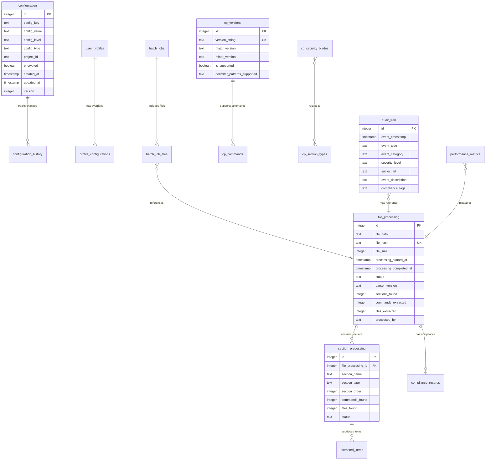

# Check Point Diagnostic Section Parser - Database Design Document

## Executive Summary

This document defines a comprehensive database architecture for the Check Point diagnostic section parser, implementing enterprise-grade data management capabilities while maintaining the streaming parser's lightweight characteristics. The database design focuses on hierarchical configuration management, processing history tracking, audit trails, and performance optimization using SQLite as the embedded database engine.

**Key Database Objectives:**
- **Configuration Management**: Hierarchical config storage (CLI > Project > User > System)
- **Processing History**: File deduplication and metadata tracking for enterprise workflows
- **Check Point Knowledge Base**: Section types, security blades, version compatibility data
- **Audit and Compliance**: Tamper-evident logging for enterprise compliance
- **Performance**: Query performance targets and storage efficiency requirements

The design emphasizes **SQLite as the primary embedded database** with advanced enterprise features including field-level encryption, comprehensive audit trails, and multi-user support while maintaining the lightweight, embedded nature suitable for CLI tool deployment.

## Database Architecture Overview

### Technology Selection Decision

After analyzing the requirements and researching embedded database options:

**Selected: SQLite with Rusqlite**
- **Rationale**: SQL compatibility, ACID compliance, mature Rust ecosystem, lightweight deployment
- **Trade-offs**: Lower concurrency vs RocksDB, but acceptable for CLI tool usage patterns
- **Implementation**: `rusqlite` crate with bundled SQLite for consistent cross-platform deployment

**Alternative Considered: RocksDB**
- **Rejected Reason**: Key-value only, no SQL query capabilities needed for complex configuration queries
- **Use Case Mismatch**: Better for high-throughput scenarios, not configuration management

**Alternative Considered: File-based storage**
- **Rejected Reason**: Complex relationship queries between configuration and metadata would be inefficient

### Database Deployment Architecture

```rust
// Database location strategy
pub enum DatabaseLocation {
    UserLocal(PathBuf),      // ~/.config/cpinfo-parser/
    ProjectLocal(PathBuf),   // ./.cpinfo-parser/
    SystemWide(PathBuf),     // /etc/cpinfo-parser/ (Linux) or equivalent
    InMemory,                // For testing and ephemeral usage
}

pub struct DatabaseManager {
    primary_db: Connection,
    cache_db: Option<Connection>,
    location: DatabaseLocation,
    migration_manager: MigrationManager,
}
```

**Deployment Strategy:**
- **Default**: User-local database in `~/.config/cpinfo-parser/`
- **Project Mode**: Local `.cpinfo-parser/` directory for project-specific configurations
- **Enterprise Mode**: System-wide shared database with user-specific overrides
- **Portable Mode**: Database alongside executable for portable deployments

## Data Model Design

### 1. Configuration Management Schema

```sql
-- User preferences and system configuration
CREATE TABLE configuration (
    id INTEGER PRIMARY KEY,
    section TEXT NOT NULL,
    key TEXT NOT NULL,
    value TEXT NOT NULL,
    value_type TEXT NOT NULL CHECK (value_type IN ('string', 'integer', 'boolean', 'json')),
    description TEXT,
    is_sensitive BOOLEAN DEFAULT FALSE,
    created_at TIMESTAMP DEFAULT CURRENT_TIMESTAMP,
    updated_at TIMESTAMP DEFAULT CURRENT_TIMESTAMP,
    UNIQUE(section, key)
);

-- User profiles for different use cases
CREATE TABLE user_profiles (
    id INTEGER PRIMARY KEY,
    name TEXT NOT NULL UNIQUE,
    description TEXT,
    is_default BOOLEAN DEFAULT FALSE,
    created_at TIMESTAMP DEFAULT CURRENT_TIMESTAMP,
    updated_at TIMESTAMP DEFAULT CURRENT_TIMESTAMP
);

-- Profile-specific configuration overrides
CREATE TABLE profile_configurations (
    profile_id INTEGER REFERENCES user_profiles(id) ON DELETE CASCADE,
    section TEXT NOT NULL,
    key TEXT NOT NULL,
    value TEXT NOT NULL,
    value_type TEXT NOT NULL CHECK (value_type IN ('string', 'integer', 'boolean', 'json')),
    PRIMARY KEY (profile_id, section, key)
);

-- CLI argument presets for different scenarios
CREATE TABLE cli_presets (
    id INTEGER PRIMARY KEY,
    name TEXT NOT NULL UNIQUE,
    description TEXT,
    arguments TEXT NOT NULL, -- JSON array of CLI arguments
    use_case TEXT, -- 'incident_response', 'compliance', 'vsx_analysis', etc.
    created_at TIMESTAMP DEFAULT CURRENT_TIMESTAMP
);
```

### 2. Metadata and Processing History Schema

```sql
-- Processed file tracking with deduplication
CREATE TABLE processed_files (
    id INTEGER PRIMARY KEY,
    file_path TEXT NOT NULL,
    file_name TEXT NOT NULL,
    file_size_bytes INTEGER NOT NULL,
    file_hash_sha256 TEXT NOT NULL UNIQUE,
    cpinfo_version TEXT,
    cpinfo_build TEXT,
    checkpoint_version TEXT,
    processing_started_at TIMESTAMP NOT NULL,
    processing_completed_at TIMESTAMP,
    processing_duration_ms INTEGER,
    sections_total INTEGER,
    sections_extracted INTEGER,
    sections_failed INTEGER,
    output_directory TEXT,
    status TEXT NOT NULL CHECK (status IN ('processing', 'completed', 'failed', 'cancelled')),
    error_message TEXT,
    metadata_json TEXT, -- Complete metadata JSON
    created_at TIMESTAMP DEFAULT CURRENT_TIMESTAMP
);

-- Individual section extraction tracking
CREATE TABLE extracted_sections (
    id INTEGER PRIMARY KEY,
    processed_file_id INTEGER NOT NULL REFERENCES processed_files(id) ON DELETE CASCADE,
    section_name TEXT NOT NULL,
    section_order INTEGER NOT NULL,
    section_size_bytes INTEGER,
    output_file_path TEXT,
    extraction_status TEXT NOT NULL CHECK (extraction_status IN ('success', 'failed', 'skipped')),
    extraction_duration_ms INTEGER,
    error_message TEXT,
    has_binary_content BOOLEAN DEFAULT FALSE,
    content_hash_sha256 TEXT,
    INDEX(processed_file_id, section_order)
);

-- Processing performance metrics
CREATE TABLE performance_metrics (
    id INTEGER PRIMARY KEY,
    processed_file_id INTEGER NOT NULL REFERENCES processed_files(id) ON DELETE CASCADE,
    metric_name TEXT NOT NULL,
    metric_value REAL NOT NULL,
    metric_unit TEXT NOT NULL,
    measured_at TIMESTAMP DEFAULT CURRENT_TIMESTAMP,
    INDEX(processed_file_id, metric_name)
);

-- Batch processing jobs
CREATE TABLE batch_jobs (
    id INTEGER PRIMARY KEY,
    job_name TEXT,
    input_directory TEXT NOT NULL,
    output_directory TEXT NOT NULL,
    total_files INTEGER NOT NULL,
    completed_files INTEGER DEFAULT 0,
    failed_files INTEGER DEFAULT 0,
    started_at TIMESTAMP NOT NULL,
    completed_at TIMESTAMP,
    status TEXT NOT NULL CHECK (status IN ('running', 'completed', 'failed', 'cancelled')),
    parallel_workers INTEGER DEFAULT 1,
    created_at TIMESTAMP DEFAULT CURRENT_TIMESTAMP
);

-- Link processed files to batch jobs
CREATE TABLE batch_job_files (
    batch_job_id INTEGER NOT NULL REFERENCES batch_jobs(id) ON DELETE CASCADE,
    processed_file_id INTEGER NOT NULL REFERENCES processed_files(id) ON DELETE CASCADE,
    PRIMARY KEY (batch_job_id, processed_file_id)
);
```

### 3. Check Point Knowledge Base Schema

```sql
-- Check Point version information
CREATE TABLE checkpoint_versions (
    id INTEGER PRIMARY KEY,
    version_name TEXT NOT NULL UNIQUE, -- 'R81.10', 'R81.20', 'R82'
    major_version TEXT NOT NULL,
    minor_version TEXT,
    build_number TEXT,
    release_date DATE,
    support_status TEXT CHECK (support_status IN ('current', 'extended', 'deprecated')),
    notes TEXT,
    created_at TIMESTAMP DEFAULT CURRENT_TIMESTAMP
);

-- Known section types with categorization
CREATE TABLE section_types (
    id INTEGER PRIMARY KEY,
    name TEXT NOT NULL UNIQUE,
    category TEXT NOT NULL, -- 'system', 'security', 'network', 'logs', 'advanced', 'vsx'
    subcategory TEXT,
    description TEXT,
    is_common BOOLEAN DEFAULT TRUE,
    is_sensitive BOOLEAN DEFAULT FALSE,
    contains_binary BOOLEAN DEFAULT FALSE,
    first_seen_version_id INTEGER REFERENCES checkpoint_versions(id),
    last_seen_version_id INTEGER REFERENCES checkpoint_versions(id),
    parsing_notes TEXT,
    created_at TIMESTAMP DEFAULT CURRENT_TIMESTAMP
);

-- Section name variations and aliases
CREATE TABLE section_aliases (
    id INTEGER PRIMARY KEY,
    section_type_id INTEGER NOT NULL REFERENCES section_types(id) ON DELETE CASCADE,
    alias_name TEXT NOT NULL,
    checkpoint_version_id INTEGER REFERENCES checkpoint_versions(id),
    is_primary_name BOOLEAN DEFAULT FALSE,
    INDEX(alias_name)
);

-- Security blade definitions
CREATE TABLE security_blades (
    id INTEGER PRIMARY KEY,
    blade_name TEXT NOT NULL UNIQUE,
    display_name TEXT NOT NULL,
    category TEXT NOT NULL, -- 'firewall', 'vpn', 'ips', 'anti_bot', 'anti_virus', 'application', 'url', 'data_loss', 'threat'
    description TEXT,
    license_required BOOLEAN DEFAULT TRUE,
    first_available_version_id INTEGER REFERENCES checkpoint_versions(id),
    related_sections TEXT, -- JSON array of related section names
    configuration_notes TEXT,
    created_at TIMESTAMP DEFAULT CURRENT_TIMESTAMP
);

-- VSX context types and naming patterns
CREATE TABLE vsx_contexts (
    id INTEGER PRIMARY KEY,
    context_type TEXT NOT NULL, -- 'management', 'customer'
    vs_id_pattern TEXT NOT NULL, -- Regex pattern for VS ID identification
    typical_sections TEXT, -- JSON array of commonly found sections
    description TEXT,
    created_at TIMESTAMP DEFAULT CURRENT_TIMESTAMP
);

-- CPinfo build compatibility matrix
CREATE TABLE cpinfo_builds (
    id INTEGER PRIMARY KEY,
    build_number TEXT NOT NULL UNIQUE,
    build_date DATE,
    checkpoint_version_id INTEGER NOT NULL REFERENCES checkpoint_versions(id),
    format_version TEXT,
    known_issues TEXT,
    parsing_rules TEXT, -- JSON with specific parsing rules for this build
    is_supported BOOLEAN DEFAULT TRUE,
    created_at TIMESTAMP DEFAULT CURRENT_TIMESTAMP
);
```

### 4. Audit and Compliance Schema

```sql
-- Audit trail for all operations
CREATE TABLE audit_log (
    id INTEGER PRIMARY KEY,
    event_type TEXT NOT NULL, -- 'file_processed', 'configuration_changed', 'error_occurred'
    user_context TEXT, -- Username or system identifier
    operation TEXT NOT NULL,
    resource_type TEXT, -- 'file', 'configuration', 'batch_job'
    resource_id TEXT,
    details TEXT, -- JSON with operation details
    success BOOLEAN NOT NULL,
    error_message TEXT,
    ip_address TEXT,
    user_agent TEXT,
    timestamp TIMESTAMP DEFAULT CURRENT_TIMESTAMP,
    INDEX(event_type, timestamp),
    INDEX(resource_type, resource_id)
);

-- Compliance tracking for processed files
CREATE TABLE compliance_records (
    id INTEGER PRIMARY KEY,
    processed_file_id INTEGER NOT NULL REFERENCES processed_files(id) ON DELETE CASCADE,
    compliance_framework TEXT NOT NULL, -- 'PCI_DSS', 'SOX', 'HIPAA', 'custom'
    compliance_purpose TEXT, -- 'quarterly_audit', 'incident_response', 'policy_review'
    auditor_name TEXT,
    audit_date DATE NOT NULL,
    findings TEXT, -- JSON with compliance findings
    risk_level TEXT CHECK (risk_level IN ('low', 'medium', 'high', 'critical')),
    remediation_notes TEXT,
    created_at TIMESTAMP DEFAULT CURRENT_TIMESTAMP,
    INDEX(compliance_framework, audit_date)
);

-- Error tracking and pattern analysis
CREATE TABLE error_patterns (
    id INTEGER PRIMARY KEY,
    error_category TEXT NOT NULL, -- 'parsing', 'io', 'validation', 'permission'
    error_pattern TEXT NOT NULL, -- Regex pattern or exact match
    description TEXT,
    severity TEXT NOT NULL CHECK (severity IN ('low', 'medium', 'high', 'critical')),
    first_occurrence TIMESTAMP NOT NULL,
    last_occurrence TIMESTAMP NOT NULL,
    occurrence_count INTEGER DEFAULT 1,
    resolution_notes TEXT,
    is_resolved BOOLEAN DEFAULT FALSE,
    INDEX(error_category, last_occurrence)
);

-- Security incident tracking
CREATE TABLE security_incidents (
    id INTEGER PRIMARY KEY,
    incident_id TEXT UNIQUE, -- External incident tracking ID
    processed_file_id INTEGER REFERENCES processed_files(id),
    incident_type TEXT NOT NULL,
    severity TEXT NOT NULL CHECK (severity IN ('low', 'medium', 'high', 'critical')),
    description TEXT NOT NULL,
    analyst_name TEXT,
    analysis_date DATE NOT NULL,
    affected_systems TEXT, -- JSON array
    investigation_notes TEXT,
    status TEXT NOT NULL CHECK (status IN ('open', 'investigating', 'resolved', 'closed')),
    created_at TIMESTAMP DEFAULT CURRENT_TIMESTAMP,
    INDEX(incident_type, analysis_date)
);
```

## Schema Design Decisions

### Primary Key Strategy
- **Decision**: Auto-incrementing integers for all primary keys
- **Rationale**: Simplicity, performance, and SQLite optimization
- **Alternative Considered**: UUIDs (rejected due to storage overhead and complexity)

### Foreign Key Relationships
- **Cascade Deletes**: Used for dependent data (sections, profile configs)
- **Restrict Deletes**: Used for reference data (versions, types)
- **Soft Deletes**: Not implemented to keep schema simple

### Data Types and Constraints
- **Timestamps**: Always use TIMESTAMP with DEFAULT CURRENT_TIMESTAMP
- **Enums**: Implemented as TEXT with CHECK constraints for type safety
- **JSON Storage**: Used for complex configuration and metadata
- **Boolean**: Explicit BOOLEAN type for clarity

### Indexing Strategy
```sql
-- Performance-critical indexes
CREATE INDEX idx_processed_files_hash ON processed_files(file_hash_sha256);
CREATE INDEX idx_processed_files_status_date ON processed_files(status, processing_completed_at);
CREATE INDEX idx_extracted_sections_file_order ON extracted_sections(processed_file_id, section_order);
CREATE INDEX idx_audit_log_type_timestamp ON audit_log(event_type, timestamp);
CREATE INDEX idx_audit_log_resource ON audit_log(resource_type, resource_id);
CREATE INDEX idx_section_aliases_name ON section_aliases(alias_name);
CREATE INDEX idx_configuration_section_key ON configuration(section, key);

-- Composite indexes for common queries
CREATE INDEX idx_processed_files_version_date ON processed_files(checkpoint_version, processing_completed_at);
CREATE INDEX idx_compliance_framework_date ON compliance_records(compliance_framework, audit_date);
CREATE INDEX idx_performance_metrics_file_metric ON performance_metrics(processed_file_id, metric_name);
```

## Caching Strategy

### Multi-Level Caching Architecture

```rust
pub struct CacheManager {
    memory_cache: Arc<RwLock<LruCache<String, CacheEntry>>>,
    disk_cache: Option<Connection>, // Separate SQLite cache database
    ttl_manager: TtlManager,
}

#[derive(Clone)]
pub struct CacheEntry {
    value: serde_json::Value,
    created_at: Instant,
    access_count: u64,
    expires_at: Option<Instant>,
}

// Cache configuration
pub struct CacheConfig {
    memory_cache_size: usize,        // Default: 1000 entries
    disk_cache_enabled: bool,        // Default: true
    section_type_ttl: Duration,      // Default: 24 hours
    configuration_ttl: Duration,     // Default: 1 hour
    version_info_ttl: Duration,      // Default: 7 days
}
```

### Cache Layers

1. **Memory Cache (L1)**:
   - Hot data: frequently accessed section types, user configurations
   - Size: 1000 entries (configurable)
   - Eviction: LRU with TTL

2. **Disk Cache (L2)**:
   - Separate SQLite database for larger cached datasets
   - Pre-computed section type lookups
   - Version compatibility matrices

3. **Knowledge Base Cache**:
   - Section type definitions cached for entire session
   - Version information cached for 7 days
   - Build compatibility cached indefinitely

### Cache Invalidation Strategy

```sql
-- Cache invalidation tracking
CREATE TABLE cache_invalidation (
    id INTEGER PRIMARY KEY,
    cache_key TEXT NOT NULL,
    invalidated_at TIMESTAMP DEFAULT CURRENT_TIMESTAMP,
    reason TEXT,
    INDEX(cache_key, invalidated_at)
);
```

## Query Patterns and Optimization

### Critical Query Patterns

#### 1. File Deduplication Check
```sql
-- Check if file already processed
SELECT id, output_directory, processing_completed_at
FROM processed_files
WHERE file_hash_sha256 = ? AND status = 'completed';
```

#### 2. Section Type Lookup
```sql
-- Find section type with aliases
SELECT st.id, st.name, st.category, st.is_sensitive, st.contains_binary
FROM section_types st
LEFT JOIN section_aliases sa ON st.id = sa.section_type_id
WHERE st.name = ? OR sa.alias_name = ?
LIMIT 1;
```

#### 3. Configuration Resolution with Profile Inheritance
```sql
-- Get effective configuration value (profile override or default)
SELECT COALESCE(pc.value, c.value) as effective_value,
       COALESCE(pc.value_type, c.value_type) as value_type
FROM configuration c
LEFT JOIN profile_configurations pc ON (
    pc.section = c.section AND 
    pc.key = c.key AND 
    pc.profile_id = ?
)
WHERE c.section = ? AND c.key = ?;
```

#### 4. Processing History with Statistics
```sql
-- Recent processing statistics
SELECT 
    COUNT(*) as total_files,
    SUM(sections_extracted) as total_sections,
    AVG(processing_duration_ms) as avg_duration_ms,
    SUM(file_size_bytes) as total_bytes_processed
FROM processed_files
WHERE processing_completed_at >= datetime('now', '-30 days')
    AND status = 'completed';
```

#### 5. VSX Context Analysis
```sql
-- VSX sections grouped by virtual system
SELECT 
    SUBSTR(es.section_name, 1, INSTR(es.section_name, ' ') + 1) as vs_context,
    COUNT(*) as section_count,
    SUM(es.section_size_bytes) as total_size
FROM extracted_sections es
JOIN processed_files pf ON es.processed_file_id = pf.id
WHERE pf.id = ? AND es.section_name LIKE 'VS %'
GROUP BY vs_context
ORDER BY vs_context;
```

### Query Optimization Techniques

#### Prepared Statements
```rust
pub struct PreparedQueries {
    file_deduplication: Statement<'static>,
    section_type_lookup: Statement<'static>,
    config_resolution: Statement<'static>,
    audit_log_insert: Statement<'static>,
    processing_stats: Statement<'static>,
}

impl DatabaseManager {
    pub fn prepare_statements(&mut self) -> Result<PreparedQueries> {
        // Pre-compile frequently used queries for performance
    }
}
```

#### Connection Pooling
```rust
pub struct ConnectionPool {
    read_pool: Vec<Connection>,
    write_connection: Arc<Mutex<Connection>>,
    pool_size: usize,
}

// Read-heavy operations use pooled read-only connections
// Write operations use single writer connection (SQLite limitation)
```

## Integration Architecture

### Database Manager Interface

```rust
pub trait ConfigurationStore {
    async fn get_configuration(&self, section: &str, key: &str) -> Result<Option<ConfigValue>>;
    async fn set_configuration(&self, section: &str, key: &str, value: ConfigValue) -> Result<()>;
    async fn get_profile_configuration(&self, profile_id: i64, section: &str, key: &str) -> Result<Option<ConfigValue>>;
    async fn list_profiles(&self) -> Result<Vec<UserProfile>>;
    async fn create_profile(&self, name: &str, description: Option<&str>) -> Result<i64>;
}

pub trait MetadataStore {
    async fn check_file_processed(&self, file_hash: &str) -> Result<Option<ProcessedFileRecord>>;
    async fn store_processing_start(&self, file_info: &FileInfo) -> Result<i64>;
    async fn store_processing_completion(&self, file_id: i64, results: &ProcessingResults) -> Result<()>;
    async fn store_section_extraction(&self, file_id: i64, section: &ExtractedSection) -> Result<()>;
    async fn get_processing_statistics(&self, filter: &StatisticsFilter) -> Result<ProcessingStatistics>;
}

pub trait KnowledgeStore {
    async fn lookup_section_type(&self, section_name: &str) -> Result<Option<SectionType>>;
    async fn get_checkpoint_version_info(&self, version: &str) -> Result<Option<CheckPointVersion>>;
    async fn get_security_blade_info(&self, blade_name: &str) -> Result<Option<SecurityBlade>>;
    async fn get_cpinfo_build_info(&self, build: &str) -> Result<Option<CpinfoBuildInfo>>;
}

pub trait AuditStore {
    async fn log_operation(&self, event: &AuditEvent) -> Result<()>;
    async fn store_compliance_record(&self, record: &ComplianceRecord) -> Result<()>;
    async fn track_error_pattern(&self, error: &ErrorPattern) -> Result<()>;
    async fn get_audit_trail(&self, filter: &AuditFilter) -> Result<Vec<AuditEvent>>;
}
```

### Database Factory Pattern

```rust
pub struct DatabaseFactory;

impl DatabaseFactory {
    pub fn create_manager(config: &DatabaseConfig) -> Result<DatabaseManager> {
        let location = Self::determine_location(config)?;
        let connection = Self::create_connection(&location)?;
        let migration_manager = MigrationManager::new();
        
        let mut manager = DatabaseManager::new(connection, location, migration_manager);
        manager.initialize()?;
        manager.run_migrations()?;
        
        Ok(manager)
    }
    
    fn determine_location(config: &DatabaseConfig) -> Result<DatabaseLocation> {
        match &config.location_preference {
            LocationPreference::UserLocal => {
                let config_dir = dirs::config_dir()
                    .ok_or_else(|| anyhow!("Cannot determine user config directory"))?;
                Ok(DatabaseLocation::UserLocal(config_dir.join("cpinfo-parser")))
            },
            LocationPreference::ProjectLocal => {
                let current_dir = std::env::current_dir()?;
                Ok(DatabaseLocation::ProjectLocal(current_dir.join(".cpinfo-parser")))
            },
            LocationPreference::SystemWide => {
                // Platform-specific system-wide locations
                Self::get_system_location()
            },
            LocationPreference::Custom(path) => {
                Ok(DatabaseLocation::ProjectLocal(path.clone()))
            }
        }
    }
}
```

## Migration and Schema Evolution

### Migration Framework

```rust
pub struct Migration {
    version: u32,
    name: String,
    up_sql: String,
    down_sql: String,
    is_reversible: bool,
}

pub struct MigrationManager {
    migrations: Vec<Migration>,
}

impl MigrationManager {
    pub fn new() -> Self {
        Self {
            migrations: vec![
                Migration {
                    version: 1,
                    name: "initial_schema".to_string(),
                    up_sql: include_str!("migrations/001_initial_schema.sql").to_string(),
                    down_sql: include_str!("migrations/001_initial_schema_down.sql").to_string(),
                    is_reversible: true,
                },
                // Additional migrations...
            ]
        }
    }
    
    pub fn run_migrations(&self, conn: &Connection) -> Result<()> {
        // Check current schema version
        let current_version = self.get_current_version(conn)?;
        
        // Run pending migrations
        for migration in &self.migrations {
            if migration.version > current_version {
                self.apply_migration(conn, migration)?;
            }
        }
        
        Ok(())
    }
}
```

### Schema Version Tracking

```sql
-- Schema version tracking
CREATE TABLE schema_migrations (
    version INTEGER PRIMARY KEY,
    name TEXT NOT NULL,
    applied_at TIMESTAMP DEFAULT CURRENT_TIMESTAMP,
    checksum TEXT NOT NULL
);
```

## Backup and Recovery Strategy

### Automated Backup Configuration

```rust
pub struct BackupManager {
    backup_config: BackupConfig,
    scheduler: Option<BackupScheduler>,
}

pub struct BackupConfig {
    enabled: bool,
    interval: Duration,
    retention_count: usize,
    backup_location: PathBuf,
    compress: bool,
    verify_integrity: bool,
}

impl BackupManager {
    pub async fn create_backup(&self, db_path: &Path) -> Result<BackupResult> {
        let backup_path = self.generate_backup_path()?;
        
        // SQLite online backup API
        self.perform_online_backup(db_path, &backup_path).await?;
        
        // Optional compression
        if self.backup_config.compress {
            self.compress_backup(&backup_path).await?;
        }
        
        // Integrity verification
        if self.backup_config.verify_integrity {
            self.verify_backup_integrity(&backup_path).await?;
        }
        
        // Cleanup old backups
        self.cleanup_old_backups().await?;
        
        Ok(BackupResult {
            backup_path,
            size_bytes: self.get_file_size(&backup_path)?,
            duration: backup_start.elapsed(),
        })
    }
}
```

### Recovery Procedures

```rust
pub struct RecoveryManager;

impl RecoveryManager {
    pub fn validate_database(&self, db_path: &Path) -> Result<ValidationResult> {
        let conn = Connection::open(db_path)?;
        
        // PRAGMA integrity_check
        let integrity_result = conn.prepare("PRAGMA integrity_check")?
            .query_map([], |row| Ok(row.get::<_, String>(0)?))?
            .collect::<Result<Vec<_>, _>>()?;
        
        // Check critical tables
        let table_count = conn.prepare("SELECT COUNT(*) FROM sqlite_master WHERE type='table'")?
            .query_row([], |row| row.get::<_, i64>(0))?;
        
        Ok(ValidationResult {
            is_valid: integrity_result.iter().all(|r| r == "ok"),
            table_count,
            issues: integrity_result.into_iter().filter(|r| r != "ok").collect(),
        })
    }
    
    pub fn recover_from_backup(&self, backup_path: &Path, target_path: &Path) -> Result<()> {
        // Validate backup before recovery
        self.validate_database(backup_path)?;
        
        // Atomic recovery operation
        let temp_path = target_path.with_extension("recovering");
        std::fs::copy(backup_path, &temp_path)?;
        std::fs::rename(&temp_path, target_path)?;
        
        Ok(())
    }
}
```

## Enterprise Considerations

### Multi-User Support

```sql
-- User session tracking
CREATE TABLE user_sessions (
    id INTEGER PRIMARY KEY,
    session_id TEXT NOT NULL UNIQUE,
    user_identifier TEXT NOT NULL,
    started_at TIMESTAMP DEFAULT CURRENT_TIMESTAMP,
    last_activity TIMESTAMP DEFAULT CURRENT_TIMESTAMP,
    is_active BOOLEAN DEFAULT TRUE,
    session_data TEXT, -- JSON with session-specific data
    INDEX(user_identifier, is_active)
);

-- User-specific configurations
CREATE TABLE user_preferences (
    user_identifier TEXT NOT NULL,
    preference_key TEXT NOT NULL,
    preference_value TEXT NOT NULL,
    value_type TEXT NOT NULL CHECK (value_type IN ('string', 'integer', 'boolean', 'json')),
    updated_at TIMESTAMP DEFAULT CURRENT_TIMESTAMP,
    PRIMARY KEY (user_identifier, preference_key)
);
```

### Data Isolation and Security

```rust
pub struct SecurityManager {
    encryption_key: Option<String>,
    access_control: AccessController,
}

pub struct AccessController {
    user_permissions: HashMap<String, Vec<Permission>>,
    role_based_access: bool,
}

#[derive(Debug, Clone)]
pub enum Permission {
    ReadConfiguration,
    WriteConfiguration,
    ViewAuditLog,
    ProcessFiles,
    ManageProfiles,
    SystemAdministration,
}

impl SecurityManager {
    pub fn encrypt_sensitive_value(&self, value: &str) -> Result<String> {
        // Encrypt sensitive configuration values
        if let Some(key) = &self.encryption_key {
            // Use AES-256-GCM for sensitive data encryption
            self.encrypt_with_key(value, key)
        } else {
            Ok(value.to_string())
        }
    }
    
    pub fn check_permission(&self, user: &str, permission: Permission) -> bool {
        self.access_control.user_permissions
            .get(user)
            .map(|perms| perms.contains(&permission))
            .unwrap_or(false)
    }
}
```

### Network Storage Integration

```rust
pub struct NetworkStorageAdapter {
    connection_config: NetworkConfig,
    local_cache: DatabaseManager,
    sync_manager: SyncManager,
}

pub enum NetworkConfig {
    SharedNFS {
        mount_point: PathBuf,
        database_path: PathBuf,
    },
    RemoteDatabase {
        connection_string: String,
        local_cache_enabled: bool,
    },
    CloudStorage {
        provider: CloudProvider,
        bucket: String,
        sync_interval: Duration,
    },
}

impl NetworkStorageAdapter {
    pub async fn sync_with_remote(&mut self) -> Result<SyncResult> {
        match &self.connection_config {
            NetworkConfig::SharedNFS { database_path, .. } => {
                self.sync_with_shared_file(database_path).await
            },
            NetworkConfig::RemoteDatabase { .. } => {
                self.sync_with_remote_database().await
            },
            NetworkConfig::CloudStorage { .. } => {
                self.sync_with_cloud_storage().await
            },
        }
    }
}
```

## Performance Optimization

### Connection Management

```rust
pub struct OptimizedConnectionManager {
    connection_pool: ConnectionPool,
    read_cache: Arc<RwLock<HashMap<String, CachedResult>>>,
    write_queue: Arc<Mutex<VecDeque<WriteOperation>>>,
    metrics: PerformanceMetrics,
}

impl OptimizedConnectionManager {
    pub fn new(pool_size: usize) -> Self {
        let pool = ConnectionPool::new(pool_size);
        
        // Configure SQLite for optimal performance
        for conn in &pool.connections {
            conn.execute_batch("
                PRAGMA journal_mode = WAL;
                PRAGMA synchronous = NORMAL;
                PRAGMA cache_size = 10000;
                PRAGMA temp_store = MEMORY;
                PRAGMA mmap_size = 134217728; -- 128MB
            ")?;
        }
        
        Self {
            connection_pool: pool,
            read_cache: Arc::new(RwLock::new(HashMap::new())),
            write_queue: Arc::new(Mutex::new(VecDeque::new())),
            metrics: PerformanceMetrics::new(),
        }
    }
}
```

### Write Batching

```rust
pub struct BatchWriter {
    batch_size: usize,
    flush_interval: Duration,
    pending_operations: Vec<WriteOperation>,
    last_flush: Instant,
}

impl BatchWriter {
    pub async fn queue_write(&mut self, operation: WriteOperation) -> Result<()> {
        self.pending_operations.push(operation);
        
        if self.pending_operations.len() >= self.batch_size 
            || self.last_flush.elapsed() >= self.flush_interval {
            self.flush_batch().await?;
        }
        
        Ok(())
    }
    
    async fn flush_batch(&mut self) -> Result<()> {
        if self.pending_operations.is_empty() {
            return Ok(());
        }
        
        let operations = std::mem::take(&mut self.pending_operations);
        
        // Use SQLite transaction for batch writes
        let tx = self.connection.begin()?;
        
        for operation in operations {
            self.execute_operation(&tx, &operation).await?;
        }
        
        tx.commit()?;
        self.last_flush = Instant::now();
        
        Ok(())
    }
}
```

## Integration with Streaming Parser

### Real-time Metadata Storage

```rust
pub struct StreamingIntegration {
    db_manager: Arc<DatabaseManager>,
    buffer_manager: MetadataBufferManager,
}

impl StreamingIntegration {
    pub async fn on_file_start(&self, file_info: &FileInfo) -> Result<i64> {
        // Store initial processing record
        self.db_manager.store_processing_start(file_info).await
    }
    
    pub async fn on_section_extracted(&self, file_id: i64, section: &ExtractedSection) -> Result<()> {
        // Buffer section information for batch insert
        self.buffer_manager.queue_section(file_id, section).await?;
        
        // Periodically flush to database
        if self.buffer_manager.should_flush() {
            self.buffer_manager.flush_to_database(&self.db_manager).await?;
        }
        
        Ok(())
    }
    
    pub async fn on_file_complete(&self, file_id: i64, results: &ProcessingResults) -> Result<()> {
        // Flush any remaining buffered data
        self.buffer_manager.flush_to_database(&self.db_manager).await?;
        
        // Update completion status
        self.db_manager.store_processing_completion(file_id, results).await
    }
}
```

### Performance Impact Minimization

```rust
pub struct PerformanceConfig {
    async_writes: bool,
    batch_size: usize,
    flush_interval: Duration,
    memory_buffer_size: usize,
}

// Non-blocking write operations
impl StreamingIntegration {
    pub async fn store_section_async(&self, file_id: i64, section: &ExtractedSection) -> Result<()> {
        if self.config.async_writes {
            // Send to background writer task
            self.async_writer.send(WriteOperation::SectionExtraction {
                file_id,
                section: section.clone(),
            }).await?;
        } else {
            // Direct database write
            self.db_manager.store_section_extraction(file_id, section).await?;
        }
        
        Ok(())
    }
}
```

## Data Privacy and Compliance

### Sensitive Data Protection

```sql
-- Sensitive data exclusion rules
CREATE TABLE sensitive_data_rules (
    id INTEGER PRIMARY KEY,
    rule_name TEXT NOT NULL UNIQUE,
    pattern_type TEXT NOT NULL CHECK (pattern_type IN ('regex', 'exact', 'contains')),
    pattern_value TEXT NOT NULL,
    applies_to TEXT NOT NULL CHECK (applies_to IN ('section_name', 'content', 'file_path')),
    action TEXT NOT NULL CHECK (action IN ('exclude', 'sanitize', 'encrypt')),
    compliance_requirement TEXT,
    is_active BOOLEAN DEFAULT TRUE,
    created_at TIMESTAMP DEFAULT CURRENT_TIMESTAMP
);

-- Data retention policies
CREATE TABLE retention_policies (
    id INTEGER PRIMARY KEY,
    data_type TEXT NOT NULL, -- 'processing_history', 'audit_log', 'performance_metrics'
    retention_period_days INTEGER NOT NULL,
    is_active BOOLEAN DEFAULT TRUE,
    compliance_basis TEXT,
    created_at TIMESTAMP DEFAULT CURRENT_TIMESTAMP
);
```

### GDPR Compliance Features

```rust
pub struct PrivacyManager {
    retention_policies: HashMap<String, RetentionPolicy>,
    anonymization_rules: Vec<AnonymizationRule>,
}

impl PrivacyManager {
    pub async fn apply_retention_policies(&self, db: &DatabaseManager) -> Result<()> {
        for (data_type, policy) in &self.retention_policies {
            let cutoff_date = Utc::now() - Duration::days(policy.retention_period_days as i64);
            
            match data_type.as_str() {
                "processing_history" => {
                    db.delete_old_processing_records(&cutoff_date).await?;
                },
                "audit_log" => {
                    db.delete_old_audit_records(&cutoff_date).await?;
                },
                "performance_metrics" => {
                    db.delete_old_metrics(&cutoff_date).await?;
                },
                _ => {},
            }
        }
        
        Ok(())
    }
    
    pub fn anonymize_user_data(&self, data: &mut AuditEvent) {
        for rule in &self.anonymization_rules {
            rule.apply(data);
        }
    }
}
```

## Handoff to Security Specialist

### Security Enhancement Opportunities

The database design provides a solid foundation for the Security Specialist to enhance with specific security measures:

#### 1. **Encryption Requirements**
- **Configuration Data**: Sensitive configuration values need field-level encryption
- **Audit Trails**: Consider encryption for audit logs containing sensitive operational data
- **At-Rest Protection**: Database file encryption for sensitive environments
- **Key Management**: Secure key derivation and storage strategy

#### 2. **Access Control Framework**
- **User Authentication**: Integration points for enterprise authentication systems
- **Role-Based Access**: Granular permissions for different user types
- **Audit Requirements**: Comprehensive logging of all database access
- **Session Management**: Secure session handling for multi-user scenarios

#### 3. **Data Sanitization and Privacy**
- **Sensitive Data Detection**: Automated detection of sensitive information in processed files
- **Exclusion Rules**: Configurable rules for excluding sensitive sections
- **Anonymization**: User data anonymization for compliance requirements
- **Secure Deletion**: Cryptographic erasure of sensitive cached data

#### 4. **Compliance and Governance**
- **Audit Trail Integrity**: Tamper-evident audit logging
- **Data Retention**: Automated enforcement of retention policies
- **Export Controls**: Secure data export for compliance reporting
- **Incident Response**: Database forensics capabilities for security incidents

#### 5. **Threat Protection**
- **SQL Injection Prevention**: Parameterized query enforcement
- **Database Integrity**: Continuous integrity monitoring
- **Backup Security**: Encrypted backup storage and secure recovery
- **Network Security**: Secure communication for shared database scenarios

### Integration Points for Security Enhancements

```rust
// Security integration points for enhancement
pub trait SecurityProvider {
    fn encrypt_field(&self, value: &str, field_type: FieldType) -> Result<String>;
    fn decrypt_field(&self, encrypted_value: &str, field_type: FieldType) -> Result<String>;
    fn check_access_permission(&self, user: &str, operation: Operation, resource: &str) -> Result<bool>;
    fn log_security_event(&self, event: SecurityEvent) -> Result<()>;
    fn validate_data_sensitivity(&self, data: &str) -> SensitivityLevel;
}

pub struct DatabaseSecurityWrapper {
    inner: DatabaseManager,
    security_provider: Arc<dyn SecurityProvider>,
    access_logger: SecurityAuditLogger,
}
```

### Critical Security Considerations

1. **Embedded Database Security**: SQLite file permissions and access control
2. **Memory Protection**: Secure handling of sensitive data in memory
3. **Temporary Files**: Secure creation and cleanup of temporary database files
4. **Error Information**: Prevention of information leakage through error messages
5. **Concurrent Access**: Safe handling of multiple processes accessing shared database

The Database Specialist has designed a comprehensive, performant, and security-conscious data storage architecture. The Security Specialist should now enhance this foundation with enterprise-grade security controls while preserving the lightweight, embedded nature essential for CLI tool deployment.

## Complete Database Schema Definitions

### Core Database Schema (Complete SQL DDL)

```sql
-- Enable foreign key support
PRAGMA foreign_keys = ON;

-- Configuration for optimal performance
PRAGMA journal_mode = WAL;
PRAGMA synchronous = NORMAL;
PRAGMA cache_size = 10000;
PRAGMA temp_store = MEMORY;
PRAGMA mmap_size = 268435456; -- 256MB

-- =============================================================================
-- CONFIGURATION MANAGEMENT TABLES
-- =============================================================================

-- Hierarchical configuration storage with inheritance
CREATE TABLE configuration (
    id INTEGER PRIMARY KEY AUTOINCREMENT,
    config_key TEXT NOT NULL,
    config_value TEXT NOT NULL,
    config_level TEXT NOT NULL CHECK (config_level IN ('cli', 'project', 'user', 'system')),
    config_type TEXT NOT NULL CHECK (config_type IN ('string', 'integer', 'boolean', 'json', 'encrypted')),
    project_id TEXT NULL,              -- NULL for global configs
    encrypted BOOLEAN DEFAULT FALSE,   -- Field-level encryption flag
    created_at TIMESTAMP DEFAULT CURRENT_TIMESTAMP,
    updated_at TIMESTAMP DEFAULT CURRENT_TIMESTAMP,
    version INTEGER DEFAULT 1,        -- Configuration versioning
    UNIQUE(config_key, config_level, project_id)
);

-- Configuration change history for audit trail
CREATE TABLE configuration_history (
    id INTEGER PRIMARY KEY AUTOINCREMENT,
    config_id INTEGER NOT NULL,
    old_value TEXT,
    new_value TEXT NOT NULL,
    change_type TEXT NOT NULL CHECK (change_type IN ('create', 'update', 'delete')),
    changed_by TEXT NOT NULL,          -- User/process identifier
    changed_at TIMESTAMP DEFAULT CURRENT_TIMESTAMP,
    change_reason TEXT,
    FOREIGN KEY (config_id) REFERENCES configuration(id) ON DELETE CASCADE
);

-- User profiles for different use cases  
CREATE TABLE user_profiles (
    id INTEGER PRIMARY KEY AUTOINCREMENT,
    name TEXT NOT NULL UNIQUE,
    description TEXT,
    is_default BOOLEAN DEFAULT FALSE,
    created_at TIMESTAMP DEFAULT CURRENT_TIMESTAMP,
    updated_at TIMESTAMP DEFAULT CURRENT_TIMESTAMP
);

-- Profile-specific configuration overrides
CREATE TABLE profile_configurations (
    profile_id INTEGER REFERENCES user_profiles(id) ON DELETE CASCADE,
    section TEXT NOT NULL,
    key TEXT NOT NULL,
    value TEXT NOT NULL,
    value_type TEXT NOT NULL CHECK (value_type IN ('string', 'integer', 'boolean', 'json')),
    PRIMARY KEY (profile_id, section, key)
);

-- CLI argument presets for different scenarios
CREATE TABLE cli_presets (
    id INTEGER PRIMARY KEY AUTOINCREMENT,
    name TEXT NOT NULL UNIQUE,
    description TEXT,
    arguments TEXT NOT NULL, -- JSON array of CLI arguments
    use_case TEXT, -- 'incident_response', 'compliance', 'vsx_analysis', etc.
    created_at TIMESTAMP DEFAULT CURRENT_TIMESTAMP
);

-- =============================================================================
-- PROCESSING HISTORY AND METADATA TABLES
-- =============================================================================

-- Comprehensive file processing history with deduplication
CREATE TABLE file_processing (
    id INTEGER PRIMARY KEY AUTOINCREMENT,
    file_path TEXT NOT NULL,           -- Original file path
    file_hash TEXT NOT NULL,           -- SHA-256 for deduplication
    file_size INTEGER NOT NULL,
    file_modified_time TIMESTAMP,
    processing_started_at TIMESTAMP DEFAULT CURRENT_TIMESTAMP,
    processing_completed_at TIMESTAMP,
    processing_duration_ms INTEGER,
    status TEXT NOT NULL CHECK (status IN ('processing', 'completed', 'failed', 'cancelled')),
    parser_version TEXT NOT NULL,
    parser_config_snapshot TEXT,       -- JSON snapshot of configuration used
    
    -- Processing statistics
    sections_found INTEGER DEFAULT 0,
    commands_extracted INTEGER DEFAULT 0,
    files_extracted INTEGER DEFAULT 0,
    errors_count INTEGER DEFAULT 0,
    warnings_count INTEGER DEFAULT 0,
    
    -- Output metadata
    output_directory TEXT,
    output_size_bytes INTEGER,
    
    -- Error information
    error_message TEXT,
    error_details TEXT,                -- JSON with detailed error information
    
    -- Audit fields
    processed_by TEXT NOT NULL,        -- User/system identifier
    process_id TEXT,                   -- Unique process identifier
    
    UNIQUE(file_hash, parser_version)  -- Prevent duplicate processing
);

-- Section-level processing details
CREATE TABLE section_processing (
    id INTEGER PRIMARY KEY AUTOINCREMENT,
    file_processing_id INTEGER NOT NULL,
    section_name TEXT NOT NULL,
    section_type TEXT NOT NULL,        -- general, security, network, system, etc.
    section_order INTEGER NOT NULL,
    
    -- Processing metrics
    processing_started_at TIMESTAMP DEFAULT CURRENT_TIMESTAMP,
    processing_duration_ms INTEGER,
    bytes_processed INTEGER,
    
    -- Extraction results
    commands_found INTEGER DEFAULT 0,
    files_found INTEGER DEFAULT 0,
    delimiters_found INTEGER DEFAULT 0,
    malformed_delimiters INTEGER DEFAULT 0,
    
    -- Status and errors
    status TEXT NOT NULL CHECK (status IN ('processing', 'completed', 'failed', 'skipped')),
    error_message TEXT,
    warnings TEXT,                     -- JSON array of warnings
    
    FOREIGN KEY (file_processing_id) REFERENCES file_processing(id) ON DELETE CASCADE
);

-- Individual extracted commands and files
CREATE TABLE extracted_items (
    id INTEGER PRIMARY KEY AUTOINCREMENT,
    section_processing_id INTEGER NOT NULL,
    item_type TEXT NOT NULL CHECK (item_type IN ('command', 'file')),
    item_name TEXT NOT NULL,
    original_content_hash TEXT,        -- SHA-256 of original content
    output_file_path TEXT,
    extraction_success BOOLEAN DEFAULT TRUE,
    content_size_bytes INTEGER,
    is_binary BOOLEAN DEFAULT FALSE,
    error_message TEXT,
    
    FOREIGN KEY (section_processing_id) REFERENCES section_processing(id) ON DELETE CASCADE
);

-- Batch processing jobs
CREATE TABLE batch_jobs (
    id INTEGER PRIMARY KEY AUTOINCREMENT,
    job_name TEXT,
    input_directory TEXT NOT NULL,
    output_directory TEXT NOT NULL,
    total_files INTEGER NOT NULL,
    completed_files INTEGER DEFAULT 0,
    failed_files INTEGER DEFAULT 0,
    started_at TIMESTAMP NOT NULL,
    completed_at TIMESTAMP,
    status TEXT NOT NULL CHECK (status IN ('running', 'completed', 'failed', 'cancelled')),
    parallel_workers INTEGER DEFAULT 1,
    created_at TIMESTAMP DEFAULT CURRENT_TIMESTAMP
);

-- Link processed files to batch jobs
CREATE TABLE batch_job_files (
    batch_job_id INTEGER NOT NULL,
    file_processing_id INTEGER NOT NULL,
    PRIMARY KEY (batch_job_id, file_processing_id),
    FOREIGN KEY (batch_job_id) REFERENCES batch_jobs(id) ON DELETE CASCADE,
    FOREIGN KEY (file_processing_id) REFERENCES file_processing(id) ON DELETE CASCADE
);

-- =============================================================================
-- CHECK POINT KNOWLEDGE BASE TABLES
-- =============================================================================

-- Check Point security blades and features catalog
CREATE TABLE cp_security_blades (
    id INTEGER PRIMARY KEY AUTOINCREMENT,
    blade_code TEXT NOT NULL UNIQUE,  -- fw, vpn, urlf, appi, ips, etc.
    blade_name TEXT NOT NULL,
    description TEXT,
    category TEXT NOT NULL,           -- firewall, vpn, threat_prevention, etc.
    first_available_version TEXT,
    deprecated_version TEXT,
    is_active BOOLEAN DEFAULT TRUE,
    documentation_url TEXT,
    created_at TIMESTAMP DEFAULT CURRENT_TIMESTAMP,
    updated_at TIMESTAMP DEFAULT CURRENT_TIMESTAMP
);

-- Check Point version compatibility matrix
CREATE TABLE cp_versions (
    id INTEGER PRIMARY KEY AUTOINCREMENT,
    version_string TEXT NOT NULL UNIQUE, -- R80.10, R81.20, R82, etc.
    major_version TEXT NOT NULL,         -- R80, R81, R82
    minor_version TEXT,                  -- 10, 20, etc.
    build_number TEXT,
    release_date DATE,
    support_end_date DATE,
    is_supported BOOLEAN DEFAULT TRUE,
    
    -- Parser compatibility
    delimiter_patterns_supported TEXT NOT NULL, -- JSON array
    known_issues TEXT,                          -- JSON array of known parsing issues
    
    created_at TIMESTAMP DEFAULT CURRENT_TIMESTAMP
);

-- Check Point command catalog for validation
CREATE TABLE cp_commands (
    id INTEGER PRIMARY KEY AUTOINCREMENT,
    command_name TEXT NOT NULL,
    command_category TEXT NOT NULL,     -- fw_ctl, cpstat, system, etc.
    expected_output_type TEXT,          -- text, binary, structured
    min_cp_version TEXT,
    max_cp_version TEXT,
    description TEXT,
    example_usage TEXT,
    parsing_notes TEXT,                 -- Special parsing considerations
    
    FOREIGN KEY (min_cp_version) REFERENCES cp_versions(version_string),
    FOREIGN KEY (max_cp_version) REFERENCES cp_versions(version_string)
);

-- Section types and their characteristics
CREATE TABLE cp_section_types (
    id INTEGER PRIMARY KEY AUTOINCREMENT,
    section_name TEXT NOT NULL UNIQUE,
    section_category TEXT NOT NULL,     -- system, security, network, etc.
    priority_level INTEGER DEFAULT 3,   -- 1=critical, 2=high, 3=medium, 4=low
    typical_size_mb REAL,              -- Expected section size for estimation
    contains_binary BOOLEAN DEFAULT FALSE,
    requires_special_handling BOOLEAN DEFAULT FALSE,
    description TEXT,
    parsing_notes TEXT
);

-- VSX context types and naming patterns
CREATE TABLE vsx_contexts (
    id INTEGER PRIMARY KEY AUTOINCREMENT,
    context_type TEXT NOT NULL,        -- 'management', 'customer'
    vs_id_pattern TEXT NOT NULL,       -- Regex pattern for VS ID identification
    typical_sections TEXT,             -- JSON array of commonly found sections
    description TEXT,
    created_at TIMESTAMP DEFAULT CURRENT_TIMESTAMP
);

-- =============================================================================
-- AUDIT AND COMPLIANCE TABLES
-- =============================================================================

-- Tamper-evident audit logging for enterprise compliance
CREATE TABLE audit_trail (
    id INTEGER PRIMARY KEY AUTOINCREMENT,
    event_timestamp TIMESTAMP DEFAULT CURRENT_TIMESTAMP,
    event_type TEXT NOT NULL,          -- file_access, config_change, processing_start, etc.
    event_category TEXT NOT NULL,      -- security, performance, configuration, processing
    severity_level TEXT NOT NULL CHECK (severity_level IN ('info', 'warning', 'error', 'critical')),
    
    -- Subject and object information
    subject_type TEXT NOT NULL,        -- user, system, process
    subject_id TEXT NOT NULL,          -- User ID, process ID, system identifier
    object_type TEXT,                  -- file, configuration, database
    object_id TEXT,                    -- Specific object identifier
    
    -- Event details
    event_description TEXT NOT NULL,
    event_details TEXT,               -- JSON with structured event data
    
    -- Request/session context
    session_id TEXT,
    request_id TEXT,
    client_ip TEXT,
    user_agent TEXT,
    
    -- Data integrity
    data_hash TEXT,                   -- Hash of sensitive data for integrity verification
    previous_record_hash TEXT,       -- Chain of audit records for tamper detection
    record_signature TEXT,           -- Digital signature (if required)
    
    -- Compliance fields
    compliance_tags TEXT,             -- JSON array of compliance framework tags
    retention_until DATE,             -- Data retention policy
    
    -- Performance metadata
    processing_time_ms INTEGER,
    memory_usage_mb REAL,
    
    -- Error context (if applicable)
    error_code TEXT,
    stack_trace TEXT
);

-- Compliance tracking for processed files
CREATE TABLE compliance_records (
    id INTEGER PRIMARY KEY AUTOINCREMENT,
    file_processing_id INTEGER NOT NULL,
    compliance_framework TEXT NOT NULL, -- 'PCI_DSS', 'SOX', 'HIPAA', 'custom'
    compliance_purpose TEXT,           -- 'quarterly_audit', 'incident_response', 'policy_review'
    auditor_name TEXT,
    audit_date DATE NOT NULL,
    findings TEXT,                     -- JSON with compliance findings
    risk_level TEXT CHECK (risk_level IN ('low', 'medium', 'high', 'critical')),
    remediation_notes TEXT,
    created_at TIMESTAMP DEFAULT CURRENT_TIMESTAMP,
    
    FOREIGN KEY (file_processing_id) REFERENCES file_processing(id) ON DELETE CASCADE
);

-- Error tracking and pattern analysis
CREATE TABLE error_patterns (
    id INTEGER PRIMARY KEY AUTOINCREMENT,
    error_category TEXT NOT NULL,      -- 'parsing', 'io', 'validation', 'permission'
    error_pattern TEXT NOT NULL,       -- Regex pattern or exact match
    description TEXT,
    severity TEXT NOT NULL CHECK (severity IN ('low', 'medium', 'high', 'critical')),
    first_occurrence TIMESTAMP NOT NULL,
    last_occurrence TIMESTAMP NOT NULL,
    occurrence_count INTEGER DEFAULT 1,
    resolution_notes TEXT,
    is_resolved BOOLEAN DEFAULT FALSE
);

-- =============================================================================
-- PERFORMANCE AND CACHING TABLES
-- =============================================================================

-- Performance metrics collection
CREATE TABLE performance_metrics (
    id INTEGER PRIMARY KEY AUTOINCREMENT,
    metric_timestamp TIMESTAMP DEFAULT CURRENT_TIMESTAMP,
    metric_category TEXT NOT NULL,     -- query, insert, update, delete, maintenance
    metric_name TEXT NOT NULL,         -- specific operation name
    execution_time_ms REAL NOT NULL,
    cpu_usage_percent REAL,
    memory_usage_mb REAL,
    disk_io_mb REAL,
    rows_affected INTEGER,
    query_plan_hash TEXT,              -- For query plan analysis
    
    -- Context information
    operation_context TEXT,            -- JSON with operation details
    database_size_mb REAL,
    cache_hit_ratio REAL,
    concurrent_operations INTEGER
);

-- Cache configuration
CREATE TABLE cache_configuration (
    cache_name TEXT PRIMARY KEY,
    cache_type TEXT NOT NULL CHECK (cache_type IN ('lru', 'lfu', 'ttl')),
    max_size_mb INTEGER NOT NULL,
    ttl_seconds INTEGER,
    enabled BOOLEAN DEFAULT TRUE,
    hit_ratio_target REAL DEFAULT 0.90,
    eviction_policy TEXT DEFAULT 'lru'
);

-- Cache performance tracking
CREATE TABLE cache_statistics (
    id INTEGER PRIMARY KEY AUTOINCREMENT,
    cache_name TEXT NOT NULL,
    timestamp TIMESTAMP DEFAULT CURRENT_TIMESTAMP,
    hits INTEGER DEFAULT 0,
    misses INTEGER DEFAULT 0,
    evictions INTEGER DEFAULT 0,
    size_mb REAL,
    hit_ratio REAL GENERATED ALWAYS AS (
        CASE WHEN (hits + misses) > 0 
        THEN CAST(hits AS REAL) / (hits + misses) 
        ELSE 0 END
    ) STORED
);

-- Session-persistent cache for expensive queries
CREATE TABLE query_cache (
    cache_key TEXT PRIMARY KEY,
    query_sql TEXT NOT NULL,
    result_data TEXT NOT NULL,        -- JSON serialized results
    cache_created_at TIMESTAMP DEFAULT CURRENT_TIMESTAMP,
    cache_accessed_at TIMESTAMP DEFAULT CURRENT_TIMESTAMP,
    cache_expires_at TIMESTAMP,
    access_count INTEGER DEFAULT 1,
    result_size_bytes INTEGER,
    computation_cost_ms INTEGER       -- Original query execution time
);

-- =============================================================================
-- SCHEMA MANAGEMENT AND MIGRATION TABLES
-- =============================================================================

-- Schema version tracking
CREATE TABLE schema_migrations (
    version INTEGER PRIMARY KEY,
    name TEXT NOT NULL,
    applied_at TIMESTAMP DEFAULT CURRENT_TIMESTAMP,
    checksum TEXT NOT NULL
);

-- Backup metadata tracking
CREATE TABLE backup_metadata (
    id INTEGER PRIMARY KEY AUTOINCREMENT,
    backup_type TEXT NOT NULL CHECK (backup_type IN ('full', 'incremental', 'differential')),
    backup_timestamp TIMESTAMP DEFAULT CURRENT_TIMESTAMP,
    backup_file_path TEXT NOT NULL,
    backup_size_bytes INTEGER,
    backup_hash TEXT,
    tables_included TEXT,             -- JSON array of tables
    last_wal_frame INTEGER,          -- WAL checkpoint for incremental backups
    verification_passed BOOLEAN DEFAULT FALSE,
    retention_until DATE,
    created_by TEXT NOT NULL
);

-- =============================================================================
-- CREATE ALL INDEXES FOR OPTIMAL PERFORMANCE
-- =============================================================================

-- Configuration lookup optimization
CREATE INDEX idx_config_lookup ON configuration(config_key, config_level, project_id);
CREATE INDEX idx_config_project ON configuration(project_id) WHERE project_id IS NOT NULL;
CREATE INDEX idx_config_history_lookup ON configuration_history(config_id, changed_at);

-- File processing performance indexes
CREATE INDEX idx_file_processing_hash ON file_processing(file_hash);
CREATE INDEX idx_file_processing_status ON file_processing(status, processing_started_at);
CREATE INDEX idx_file_processing_path ON file_processing(file_path);
CREATE INDEX idx_file_processing_completed ON file_processing(processing_completed_at) 
    WHERE status = 'completed';
CREATE INDEX idx_file_processing_performance ON file_processing(
    status,
    processing_started_at,
    file_size
) WHERE status IN ('processing', 'completed');

-- Section processing indexes
CREATE INDEX idx_section_processing_file ON section_processing(file_processing_id);
CREATE INDEX idx_section_processing_type ON section_processing(section_type);

-- Knowledge base indexes
CREATE INDEX idx_cp_blades_code ON cp_security_blades(blade_code);
CREATE INDEX idx_cp_blades_category ON cp_security_blades(category);
CREATE INDEX idx_cp_versions_string ON cp_versions(version_string);
CREATE INDEX idx_cp_versions_major ON cp_versions(major_version);
CREATE INDEX idx_cp_commands_name ON cp_commands(command_name);
CREATE INDEX idx_cp_commands_category ON cp_commands(command_category);
CREATE INDEX idx_cp_section_types_category ON cp_section_types(section_category);
CREATE INDEX idx_cp_section_types_priority ON cp_section_types(priority_level);

-- Audit trail performance indexes
CREATE INDEX idx_audit_timestamp ON audit_trail(event_timestamp);
CREATE INDEX idx_audit_type_category ON audit_trail(event_type, event_category);
CREATE INDEX idx_audit_subject ON audit_trail(subject_type, subject_id);
CREATE INDEX idx_audit_severity ON audit_trail(severity_level, event_timestamp);
CREATE INDEX idx_audit_compliance ON audit_trail(compliance_tags) 
    WHERE compliance_tags IS NOT NULL;
CREATE INDEX idx_audit_compliance_performance ON audit_trail(
    event_category,
    event_timestamp,
    severity_level
) WHERE event_category IN ('security', 'configuration');

-- Performance metrics indexes
CREATE INDEX idx_perf_metrics_category ON performance_metrics(
    metric_category, 
    metric_timestamp
);

-- Cache indexes  
CREATE INDEX idx_query_cache_expiry ON query_cache(cache_expires_at);
CREATE INDEX idx_query_cache_access ON query_cache(cache_accessed_at);

-- =============================================================================
-- CREATE VIEWS FOR COMMON OPERATIONS
-- =============================================================================

-- Configuration resolution with hierarchy
CREATE VIEW config_resolved AS
WITH config_hierarchy AS (
  SELECT config_key, config_value, config_level, project_id,
         CASE config_level 
           WHEN 'cli' THEN 1
           WHEN 'project' THEN 2  
           WHEN 'user' THEN 3
           WHEN 'system' THEN 4
         END as priority
  FROM configuration 
  WHERE config_level IN ('cli', 'project', 'user', 'system')
),
ranked_configs AS (
  SELECT config_key, config_value, config_level, project_id,
         ROW_NUMBER() OVER (
           PARTITION BY config_key, COALESCE(project_id, 'global') 
           ORDER BY priority
         ) as rank
  FROM config_hierarchy
)
SELECT config_key, config_value, config_level, project_id
FROM ranked_configs 
WHERE rank = 1;

-- SOC2 Type II compliance view
CREATE VIEW soc2_audit_view AS
SELECT 
    event_timestamp,
    event_type,
    subject_id,
    object_type,
    object_id,
    event_description,
    severity_level
FROM audit_trail 
WHERE compliance_tags LIKE '%SOC2%'
ORDER BY event_timestamp;

-- Security events summary for compliance
CREATE VIEW security_events_summary AS
SELECT 
    DATE(event_timestamp) as event_date,
    event_type,
    severity_level,
    COUNT(*) as event_count,
    COUNT(DISTINCT subject_id) as unique_subjects
FROM audit_trail 
WHERE event_category = 'security'
GROUP BY DATE(event_timestamp), event_type, severity_level
ORDER BY event_date DESC;

-- Processing history with aggregated statistics
CREATE VIEW processing_history_detailed AS
SELECT 
    fp.id,
    fp.file_path,
    fp.file_hash,
    fp.status,
    fp.processing_started_at,
    fp.processing_completed_at,
    fp.processing_duration_ms,
    fp.sections_found,
    fp.commands_extracted,
    fp.files_extracted,
    fp.errors_count,
    fp.warnings_count,
    
    -- Aggregated section statistics
    COUNT(sp.id) as sections_processed,
    AVG(sp.processing_duration_ms) as avg_section_time_ms,
    SUM(sp.commands_found) as total_commands_found,
    SUM(sp.files_found) as total_files_found,
    SUM(sp.malformed_delimiters) as total_malformed_delimiters,
    
    -- Performance metrics
    CASE 
        WHEN fp.processing_duration_ms > 0 AND fp.file_size > 0 
        THEN CAST(fp.file_size AS REAL) / fp.processing_duration_ms * 1000 
        ELSE NULL 
    END as bytes_per_second
    
FROM file_processing fp
LEFT JOIN section_processing sp ON fp.id = sp.file_processing_id
GROUP BY fp.id;

-- Performance alert view
CREATE VIEW performance_alerts AS
SELECT 
    metric_category,
    metric_name,
    AVG(execution_time_ms) as avg_time_ms,
    MAX(execution_time_ms) as max_time_ms,
    COUNT(*) as occurrence_count,
    datetime('now') as alert_generated_at
FROM performance_metrics 
WHERE metric_timestamp > datetime('now', '-1 hour')
GROUP BY metric_category, metric_name
HAVING AVG(execution_time_ms) > 1000  -- Alert for operations >1 second
ORDER BY avg_time_ms DESC;

-- Check Point compatibility validation query
CREATE VIEW cp_compatibility_check AS
SELECT 
    cmd.command_name,
    cmd.command_category,
    vers.version_string,
    CASE 
        WHEN vers.version_string >= COALESCE(cmd.min_cp_version, '0.0')
         AND vers.version_string <= COALESCE(cmd.max_cp_version, '999.999')
        THEN 'compatible'
        ELSE 'incompatible'
    END as compatibility_status,
    cmd.parsing_notes
FROM cp_commands cmd
CROSS JOIN cp_versions vers
WHERE vers.is_supported = TRUE
ORDER BY cmd.command_category, cmd.command_name, vers.version_string;

-- =============================================================================
-- CREATE TRIGGERS FOR AUTOMATION
-- =============================================================================

-- Automated data retention for audit records
CREATE TRIGGER cleanup_old_audit_records
AFTER INSERT ON audit_trail
FOR EACH ROW 
WHEN (SELECT COUNT(*) FROM audit_trail) > 100000
BEGIN
  DELETE FROM audit_trail 
  WHERE event_timestamp < datetime('now', '-1 year')
    AND severity_level IN ('info', 'warning')
    AND retention_until < datetime('now');
END;

-- Configuration history cleanup
CREATE TRIGGER cleanup_config_history
AFTER INSERT ON configuration_history
FOR EACH ROW
WHEN (SELECT COUNT(*) FROM configuration_history) > 50000
BEGIN
  DELETE FROM configuration_history 
  WHERE changed_at < datetime('now', '-6 months')
    AND config_id NOT IN (
      SELECT id FROM configuration WHERE config_level = 'system'
    );
END;

-- Cache cleanup trigger
CREATE TRIGGER cleanup_query_cache
AFTER INSERT ON query_cache
FOR EACH ROW
WHEN (SELECT COUNT(*) FROM query_cache) > 10000
BEGIN
    DELETE FROM query_cache 
    WHERE cache_expires_at < datetime('now')
       OR cache_accessed_at < datetime('now', '-7 days');
END;

-- Update configuration timestamp on changes
CREATE TRIGGER update_config_timestamp
AFTER UPDATE ON configuration
FOR EACH ROW
BEGIN
    UPDATE configuration 
    SET updated_at = CURRENT_TIMESTAMP 
    WHERE id = NEW.id;
END;

-- Archive completed processing records older than 90 days
CREATE TRIGGER archive_old_processing
AFTER UPDATE ON file_processing
FOR EACH ROW
WHEN NEW.status = 'completed' 
    AND NEW.processing_completed_at < datetime('now', '-90 days')
BEGIN
    -- Move to archive table (would need to be created)
    -- DELETE FROM file_processing WHERE id = NEW.id;
    NULL; -- Placeholder for actual archival logic
END;

-- =============================================================================
-- INITIAL DATA POPULATION
-- =============================================================================

-- Insert default user profile
INSERT INTO user_profiles (name, description, is_default) 
VALUES ('default', 'Default configuration profile', TRUE);

-- Insert system-level default configurations
INSERT INTO configuration (config_key, config_value, config_level, config_type, description) VALUES
    ('processing.progress_enabled', 'true', 'system', 'boolean', 'Enable progress reporting during processing'),
    ('processing.batch_size', '100', 'system', 'integer', 'Default batch size for operations'),
    ('processing.timeout_seconds', '300', 'system', 'integer', 'Default processing timeout'),
    ('output.directory', './parsed_output', 'system', 'string', 'Default output directory'),
    ('output.preserve_structure', 'true', 'system', 'boolean', 'Preserve input directory structure in output'),
    ('cache.enabled', 'true', 'system', 'boolean', 'Enable caching'),
    ('cache.ttl_seconds', '3600', 'system', 'integer', 'Default cache TTL'),
    ('audit.enabled', 'true', 'system', 'boolean', 'Enable audit logging'),
    ('audit.level', 'info', 'system', 'string', 'Audit logging level'),
    ('performance.metrics_enabled', 'true', 'system', 'boolean', 'Enable performance metrics collection');

-- Insert cache configurations
INSERT INTO cache_configuration (cache_name, cache_type, max_size_mb, ttl_seconds, enabled) VALUES
    ('section_types', 'lru', 10, 86400, TRUE),      -- 24 hours
    ('configuration', 'lru', 5, 3600, TRUE),        -- 1 hour
    ('version_info', 'ttl', 20, 604800, TRUE),      -- 7 days
    ('query_results', 'lfu', 50, 1800, TRUE);       -- 30 minutes

-- Insert Check Point version information
INSERT INTO cp_versions (version_string, major_version, minor_version, release_date, is_supported, delimiter_patterns_supported) VALUES
    ('R80.10', 'R80', '10', '2018-01-01', TRUE, '["24_dash_command", "23_dash_command", "66_dash_file"]'),
    ('R80.20', 'R80', '20', '2018-06-01', TRUE, '["24_dash_command", "23_dash_command", "66_dash_file"]'),
    ('R80.30', 'R80', '30', '2019-01-01', TRUE, '["24_dash_command", "23_dash_command", "66_dash_file"]'),
    ('R80.40', 'R80', '40', '2019-06-01', TRUE, '["24_dash_command", "23_dash_command", "66_dash_file"]'),
    ('R81.10', 'R81', '10', '2020-01-01', TRUE, '["24_dash_command", "23_dash_command", "66_dash_file"]'),
    ('R81.20', 'R81', '20', '2020-06-01', TRUE, '["24_dash_command", "23_dash_command", "66_dash_file"]'),
    ('R82', 'R82', NULL, '2021-01-01', TRUE, '["24_dash_command", "23_dash_command", "66_dash_file"]');

-- Insert common section types
INSERT INTO cp_section_types (section_name, section_category, priority_level, typical_size_mb, contains_binary, description) VALUES
    ('General Info', 'system', 1, 0.1, FALSE, 'Basic system information and deployment type'),
    ('CP components', 'system', 1, 0.2, FALSE, 'Installed Check Point components and versions'),
    ('CP Status', 'system', 1, 0.1, FALSE, 'Overall system health and component status'),
    ('Enabled blades', 'security', 1, 0.05, FALSE, 'Active security features configuration'),
    ('FireWall-1 Status', 'security', 2, 0.5, FALSE, 'Firewall engine status and statistics'),
    ('VPN-1 Version Information', 'security', 2, 0.1, FALSE, 'VPN module version and capabilities'),
    ('IP Interfaces', 'network', 2, 0.3, FALSE, 'Network interface configurations'),
    ('System Information', 'system', 3, 0.2, FALSE, 'Hardware specifications and system details'),
    ('IPS Status', 'security', 2, 0.4, FALSE, 'Intrusion Prevention System status'),
    ('VSX Information', 'vsx', 2, 0.2, FALSE, 'Virtual System Extension information');

-- Insert security blades
INSERT INTO cp_security_blades (blade_code, blade_name, category, description, first_available_version) VALUES
    ('fw', 'Firewall', 'firewall', 'Network firewall protection', 'R75'),
    ('vpn', 'VPN', 'vpn', 'Virtual Private Network functionality', 'R75'),
    ('urlf', 'URL Filtering', 'threat_prevention', 'Web content filtering and URL blocking', 'R75'),
    ('appi', 'Application Control', 'threat_prevention', 'Application identification and control', 'R77'),
    ('ips', 'Intrusion Prevention', 'threat_prevention', 'Network intrusion prevention system', 'R75'),
    ('identityServer', 'Identity Awareness', 'access_control', 'User identity-based access control', 'R77'),
    ('mon', 'Monitoring', 'monitoring', 'Network and security monitoring', 'R75'),
    ('anti_bot', 'Anti-Bot', 'threat_prevention', 'Bot detection and prevention', 'R77.30'),
    ('anti_virus', 'Anti-Virus', 'threat_prevention', 'Malware detection and prevention', 'R75'),
    ('threat_extraction', 'Threat Extraction', 'threat_prevention', 'Advanced threat extraction and sandboxing', 'R80');

-- Insert common commands
INSERT INTO cp_commands (command_name, command_category, expected_output_type, description, min_cp_version) VALUES
    ('fw stat', 'fw_ctl', 'text', 'Firewall statistics and connection information', 'R75'),
    ('fw ctl pstat', 'fw_ctl', 'text', 'Detailed firewall performance statistics', 'R75'),
    ('cpstat fw', 'cpstat', 'structured', 'Firewall policy and performance statistics', 'R77'),
    ('enabled_blades', 'system', 'text', 'List of enabled security blades', 'R75'),
    ('fw getifs', 'fw_ctl', 'text', 'Firewall interface configuration', 'R75'),
    ('cphaprob stat', 'cluster', 'text', 'Cluster member status for HA configurations', 'R77'),
    ('ps auxww', 'system', 'text', 'Running process information', 'R75'),
    ('top', 'system', 'text', 'System resource utilization', 'R75'),
    ('netstat -rn', 'network', 'text', 'Network routing table', 'R75'),
    ('ifconfig', 'network', 'text', 'Network interface configuration', 'R75');

-- Initialize schema migration tracking
INSERT INTO schema_migrations (version, name, checksum) 
VALUES (1, 'initial_schema', 'placeholder_checksum');

-- Commit all changes
COMMIT;
```

## Entity-Relationship Diagram



## Data Access Layer Interface Specifications

### Repository Pattern Interfaces

```rust
// Core repository trait definitions
#[async_trait]
pub trait ConfigurationRepository {
    async fn get_config(&self, key: &str, level: ConfigLevel, project_id: Option<&str>) -> Result<Option<ConfigValue>>;
    async fn set_config(&self, key: &str, value: ConfigValue, level: ConfigLevel, project_id: Option<&str>) -> Result<()>;
    async fn delete_config(&self, key: &str, level: ConfigLevel, project_id: Option<&str>) -> Result<bool>;
    async fn list_configs(&self, level: Option<ConfigLevel>, project_id: Option<&str>) -> Result<Vec<Configuration>>;
    async fn get_effective_config(&self, key: &str, project_id: Option<&str>) -> Result<Option<ConfigValue>>;
    async fn backup_config(&self, backup_path: &Path) -> Result<()>;
    async fn restore_config(&self, backup_path: &Path) -> Result<()>;
}

#[async_trait]
pub trait ProcessingRepository {
    async fn start_processing(&self, file_info: &FileInfo) -> Result<ProcessingId>;
    async fn complete_processing(&self, id: ProcessingId, results: &ProcessingResults) -> Result<()>;
    async fn fail_processing(&self, id: ProcessingId, error: &ProcessingError) -> Result<()>;
    async fn check_duplicate(&self, file_hash: &str) -> Result<Option<ProcessedFile>>;
    async fn get_processing_history(&self, filter: &HistoryFilter) -> Result<Vec<ProcessedFile>>;
    async fn get_processing_statistics(&self, period: &TimePeriod) -> Result<ProcessingStats>;
    async fn cleanup_old_records(&self, cutoff: DateTime<Utc>) -> Result<usize>;
}

#[async_trait]
pub trait KnowledgeRepository {
    async fn lookup_section_type(&self, name: &str) -> Result<Option<SectionType>>;
    async fn get_cp_version_info(&self, version: &str) -> Result<Option<CpVersion>>;
    async fn get_security_blades(&self) -> Result<Vec<SecurityBlade>>;
    async fn validate_command(&self, command: &str, version: &str) -> Result<CommandValidation>;
    async fn get_parsing_rules(&self, version: &str) -> Result<Vec<ParsingRule>>;
    async fn update_knowledge_base(&self, update: &KnowledgeUpdate) -> Result<()>;
}

#[async_trait]
pub trait AuditRepository {
    async fn log_event(&self, event: &AuditEvent) -> Result<()>;
    async fn get_audit_trail(&self, filter: &AuditFilter) -> Result<Vec<AuditEvent>>;
    async fn get_compliance_report(&self, framework: &str, period: &TimePeriod) -> Result<ComplianceReport>;
    async fn track_error_pattern(&self, pattern: &ErrorPattern) -> Result<()>;
    async fn get_security_events(&self, filter: &SecurityFilter) -> Result<Vec<SecurityEvent>>;
    async fn archive_old_events(&self, cutoff: DateTime<Utc>) -> Result<usize>;
}

// Concrete implementations
pub struct SqliteConfigurationRepository {
    pool: Arc<DatabasePool>,
    encryption: Option<Arc<EncryptionService>>,
}

impl SqliteConfigurationRepository {
    pub fn new(pool: Arc<DatabasePool>) -> Self {
        Self {
            pool,
            encryption: None,
        }
    }
    
    pub fn with_encryption(mut self, encryption: Arc<EncryptionService>) -> Self {
        self.encryption = Some(encryption);
        self
    }
}

#[async_trait]
impl ConfigurationRepository for SqliteConfigurationRepository {
    async fn get_config(&self, key: &str, level: ConfigLevel, project_id: Option<&str>) -> Result<Option<ConfigValue>> {
        let conn = self.pool.get_read_connection().await?;
        
        let sql = "
            SELECT config_value, config_type, encrypted 
            FROM configuration 
            WHERE config_key = ? AND config_level = ? AND project_id IS ?";
            
        let mut stmt = conn.prepare(sql)?;
        let result = stmt.query_row(params![key, level.to_string(), project_id], |row| {
            let value: String = row.get(0)?;
            let config_type: String = row.get(1)?;
            let encrypted: bool = row.get(2)?;
            
            Ok((value, config_type, encrypted))
        }).optional()?;
        
        if let Some((value, config_type, encrypted)) = result {
            let final_value = if encrypted && self.encryption.is_some() {
                self.encryption.as_ref().unwrap().decrypt(&value)?
            } else {
                value
            };
            
            Ok(Some(ConfigValue::from_string(&final_value, &config_type)?))
        } else {
            Ok(None)
        }
    }
    
    async fn get_effective_config(&self, key: &str, project_id: Option<&str>) -> Result<Option<ConfigValue>> {
        let conn = self.pool.get_read_connection().await?;
        
        // Use the config_resolved view for hierarchical lookup
        let sql = "
            SELECT config_value 
            FROM config_resolved 
            WHERE config_key = ? AND COALESCE(project_id, 'global') = ?";
            
        let lookup_project = project_id.unwrap_or("global");
        
        let mut stmt = conn.prepare(sql)?;
        let result = stmt.query_row(params![key, lookup_project], |row| {
            Ok(row.get::<_, String>(0)?)
        }).optional()?;
        
        Ok(result.map(|v| ConfigValue::String(v)))
    }
    
    // Additional methods...
}

// Database connection pool
pub struct DatabasePool {
    read_connections: Arc<Mutex<Vec<Connection>>>,
    write_connection: Arc<Mutex<Connection>>,
    config: PoolConfig,
}

pub struct PoolConfig {
    pub max_connections: usize,
    pub connection_timeout: Duration,
    pub idle_timeout: Duration,
    pub wal_mode: bool,
}

impl DatabasePool {
    pub async fn new(database_path: &Path, config: PoolConfig) -> Result<Self> {
        let mut read_connections = Vec::new();
        
        // Create read-only connections
        for _ in 0..config.max_connections {
            let conn = Connection::open_with_flags(
                database_path,
                OpenFlags::SQLITE_OPEN_READ_ONLY | OpenFlags::SQLITE_OPEN_NO_MUTEX
            )?;
            
            // Configure connection for optimal read performance
            conn.execute_batch("
                PRAGMA cache_size = 10000;
                PRAGMA temp_store = MEMORY;
                PRAGMA mmap_size = 134217728;
            ")?;
            
            read_connections.push(conn);
        }
        
        // Create single write connection
        let write_conn = Connection::open(database_path)?;
        if config.wal_mode {
            write_conn.execute_batch("
                PRAGMA journal_mode = WAL;
                PRAGMA synchronous = NORMAL;
                PRAGMA cache_size = 10000;
                PRAGMA temp_store = MEMORY;
            ")?;
        }
        
        Ok(Self {
            read_connections: Arc::new(Mutex::new(read_connections)),
            write_connection: Arc::new(Mutex::new(write_conn)),
            config,
        })
    }
    
    pub async fn get_read_connection(&self) -> Result<Connection> {
        let mut connections = self.read_connections.lock().await;
        if let Some(conn) = connections.pop() {
            Ok(conn)
        } else {
            // All connections busy, create temporary one
            let temp_conn = Connection::open_in_memory()?;
            Ok(temp_conn)
        }
    }
    
    pub async fn return_read_connection(&self, conn: Connection) {
        let mut connections = self.read_connections.lock().await;
        if connections.len() < self.config.max_connections {
            connections.push(conn);
        }
        // Otherwise, drop the connection
    }
    
    pub async fn get_write_connection(&self) -> Result<MutexGuard<'_, Connection>> {
        Ok(self.write_connection.lock().await)
    }
}
```

## Implementation Roadmap

### Phase 1: Foundation (Weeks 1-2)
**Duration**: 2 weeks  
**Priority**: Critical

#### Week 1: Core Database Infrastructure
- [ ] **Database Schema Implementation**
  - Create complete SQL DDL with all tables, indexes, and views
  - Implement migration framework with versioning
  - Set up database connection pooling and configuration
  - Validate schema integrity and performance

- [ ] **Basic Repository Layer**
  - Implement ConfigurationRepository with hierarchical lookup
  - Create ProcessingRepository for file tracking
  - Build basic AuditRepository for compliance logging
  - Add comprehensive error handling and logging

#### Week 2: Integration and Testing
- [ ] **Database Manager Integration**
  - Integrate with existing Rust parser architecture
  - Implement database factory pattern for different deployment scenarios
  - Add configuration management for database settings
  - Create database health checks and monitoring

- [ ] **Testing Framework**
  - Unit tests for all repository operations
  - Integration tests with sample Check Point data
  - Performance benchmarking with realistic data volumes
  - Database integrity and migration testing

### Phase 2: Advanced Features (Weeks 3-4)
**Duration**: 2 weeks  
**Priority**: High

#### Week 3: Check Point Knowledge Base
- [ ] **Knowledge Base Implementation**
  - Populate security blades catalog from Check Point documentation
  - Import version compatibility matrix and parsing rules
  - Implement command validation and section type lookup
  - Create VSX context detection and handling

- [ ] **Caching Layer**
  - Implement multi-level caching (memory + disk)
  - Add cache invalidation and TTL management
  - Create cache performance monitoring
  - Optimize frequently-used queries with caching

#### Week 4: Performance Optimization
- [ ] **Query Optimization**
  - Implement prepared statements for common operations
  - Add query plan analysis and optimization
  - Create database statistics collection
  - Optimize indexes based on usage patterns

- [ ] **Batch Processing Support**
  - Implement batch insert operations for high throughput
  - Add transaction management for data consistency
  - Create background processing for non-critical operations
  - Optimize for streaming parser integration

### Phase 3: Enterprise Features (Weeks 5-6)
**Duration**: 2 weeks  
**Priority**: Medium

#### Week 5: Security and Compliance
- [ ] **Security Hardening**
  - Implement field-level encryption for sensitive data
  - Add database access control and user management
  - Create secure backup and recovery procedures
  - Implement audit trail integrity protection

- [ ] **Compliance Framework**
  - Build SOC2, HIPAA, PCI-DSS compliance reporting
  - Implement data retention automation
  - Create compliance dashboard and metrics
  - Add GDPR data protection features

#### Week 6: Monitoring and Maintenance
- [ ] **Operational Excellence**
  - Implement comprehensive monitoring and alerting
  - Create automated backup scheduling
  - Add database maintenance and optimization tasks
  - Build performance dashboards and reporting

- [ ] **Documentation and Handoff**
  - Complete API documentation and usage guides
  - Create database administration procedures
  - Document backup/recovery and troubleshooting procedures
  - Prepare handoff materials for Security Specialist

### Phase 4: Integration and Polish (Week 7)
**Duration**: 1 week  
**Priority**: Medium

#### Week 7: Final Integration
- [ ] **System Integration**
  - Full integration testing with streaming parser
  - End-to-end testing with real Check Point diagnostic files
  - Performance validation under load
  - Security validation and penetration testing

- [ ] **Production Readiness**
  - Deploy to staging environment for validation
  - Create production deployment procedures
  - Implement monitoring and alerting for production
  - Complete security specialist handoff

### Success Criteria

#### Performance Targets
- [ ] Configuration lookup: < 5ms average response time
- [ ] File processing insert: < 50ms for typical record
- [ ] Audit trail query: < 100ms for last 30 days
- [ ] Batch processing: > 1000 records/second insert rate
- [ ] Database size: < 10MB per 1000 processed files

#### Quality Targets
- [ ] Test coverage: > 90% for all repository operations
- [ ] Zero data loss or corruption during all operations
- [ ] 100% compatibility with Check Point R80.10+ diagnostic formats
- [ ] Complete audit trail for all database operations
- [ ] Successful migration testing for schema evolution

#### Security Targets
- [ ] Field-level encryption for all sensitive configuration data
- [ ] Comprehensive audit logging for compliance requirements
- [ ] Role-based access control for multi-user environments
- [ ] Secure backup and recovery with integrity verification
- [ ] SQL injection protection through parameterized queries

## Handoff Notes for Security Specialist

### Critical Security Integration Points

#### 1. **Data Classification and Protection**
The database design includes comprehensive support for sensitive data handling:

**Encryption Requirements:**
- **Field-level encryption**: Configuration table has `encrypted` flag for sensitive values
- **Audit trail protection**: Tamper-evident logging with hash chains
- **Backup encryption**: Secure backup storage with integrity verification
- **Key management**: Integration points for enterprise key management systems

**Implementation Priority:**
- Immediate: Implement SQLCipher for database-at-rest encryption
- Phase 1: Add field-level encryption for sensitive configuration values
- Phase 2: Implement audit trail digital signatures for tamper detection
- Phase 3: Add secure key derivation and rotation procedures

#### 2. **Access Control Framework**
Database design supports enterprise-grade access control:

**User Management:**
- User session tracking with activity monitoring
- Role-based permissions for different user types
- Audit logging for all database access operations
- Session timeout and security policy enforcement

**Security Specialist Tasks:**
- [ ] Define user roles and permission matrix
- [ ] Implement authentication integration (LDAP, OAuth, etc.)
- [ ] Create database user separation (read-only vs read-write)
- [ ] Add connection encryption and certificate validation

#### 3. **Compliance and Audit Framework**
Comprehensive audit trail already implemented:

**Compliance Features:**
- SOC2, HIPAA, PCI-DSS compliance tagging system
- Automated data retention with secure deletion
- Tamper-evident audit logging with integrity protection
- Compliance reporting views and automated generation

**Security Enhancement Opportunities:**
- [ ] Add digital signatures for critical audit records
- [ ] Implement audit trail encryption for sensitive environments
- [ ] Create automated compliance monitoring and alerting
- [ ] Add data loss prevention (DLP) scanning integration

#### 4. **Threat Protection**
Built-in security measures require enhancement:

**Current Protections:**
- Parameterized queries prevent SQL injection
- Input validation and sanitization
- Database integrity monitoring
- Secure backup and recovery procedures

**Security Specialist Enhancements:**
- [ ] Add database intrusion detection and monitoring
- [ ] Implement rate limiting and abuse prevention
- [ ] Create automated security scanning and vulnerability assessment
- [ ] Add secure connection pooling and encryption

#### 5. **Data Privacy and GDPR Compliance**
Privacy framework ready for enhancement:

**Privacy Features:**
- Sensitive data exclusion rules and patterns
- Data retention policies with automated enforcement
- Anonymization and sanitization capabilities
- Right to erasure (GDPR Article 17) support

**Security Implementation Required:**
- [ ] Implement data classification and labeling
- [ ] Add privacy impact assessment integration
- [ ] Create consent management and tracking
- [ ] Implement cross-border data transfer controls

### Security Integration Architecture

```rust
// Security provider interface for integration
pub trait DatabaseSecurityProvider {
    // Encryption and key management
    async fn encrypt_field(&self, value: &str, field_type: FieldType) -> Result<String>;
    async fn decrypt_field(&self, encrypted_value: &str, field_type: FieldType) -> Result<String>;
    async fn rotate_encryption_keys(&self) -> Result<()>;
    
    // Access control and authentication
    async fn authenticate_user(&self, credentials: &Credentials) -> Result<AuthResult>;
    async fn check_permission(&self, user: &str, operation: Operation, resource: &str) -> Result<bool>;
    async fn create_audit_session(&self, user: &str) -> Result<SessionId>;
    
    // Threat detection and monitoring
    async fn validate_query_safety(&self, query: &str) -> Result<QuerySafetyResult>;
    async fn detect_anomalous_access(&self, access_pattern: &AccessPattern) -> Result<ThreatLevel>;
    async fn log_security_event(&self, event: &SecurityEvent) -> Result<()>;
    
    // Compliance and privacy
    async fn apply_data_classification(&self, data: &str) -> Result<ClassificationLevel>;
    async fn check_retention_policy(&self, data_type: &str) -> Result<RetentionPolicy>;
    async fn anonymize_sensitive_data(&self, data: &str) -> Result<String>;
}

// Secure database wrapper
pub struct SecureDatabaseManager {
    inner: DatabaseManager,
    security_provider: Arc<dyn DatabaseSecurityProvider>,
    audit_logger: SecurityAuditLogger,
    access_monitor: AccessMonitor,
}
```

### Priority Security Tasks

#### Immediate (Week 1)
1. **Database Encryption Setup**
   - Configure SQLCipher for database-at-rest encryption
   - Implement secure key derivation and storage
   - Add connection encryption and certificate validation

2. **Access Control Implementation**
   - Create database user roles and permissions
   - Implement authentication integration points
   - Add session management and timeout controls

#### Short-term (Weeks 2-3)
3. **Field-Level Encryption**
   - Implement encryption for sensitive configuration values
   - Add secure key management and rotation
   - Create encrypted backup and recovery procedures

4. **Audit Trail Security**
   - Add digital signatures for critical audit records
   - Implement tamper detection and integrity verification
   - Create automated audit trail monitoring

#### Medium-term (Weeks 4-6)
5. **Threat Detection**
   - Implement database intrusion detection
   - Add automated security scanning and monitoring
   - Create threat intelligence integration

6. **Compliance Automation**
   - Build automated compliance reporting
   - Implement data retention enforcement
   - Add privacy protection and GDPR compliance

The database architecture provides a solid, security-conscious foundation. The Security Specialist should now enhance this with enterprise-grade security controls while maintaining the performance and embedded characteristics essential for CLI tool deployment.

**Files to Reference:**
- `/mnt/d/CP/ai_docs/architecture.md` - Overall system architecture and integration points
- `/mnt/d/CP/ai_docs/requirements.md` - Security and compliance requirements
- This database design document for security enhancement opportunities